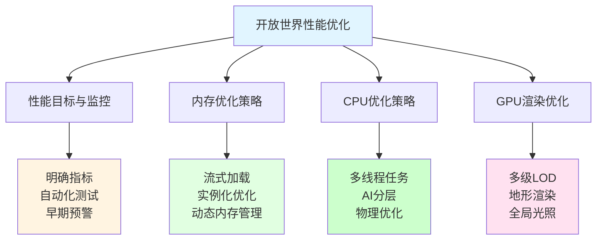
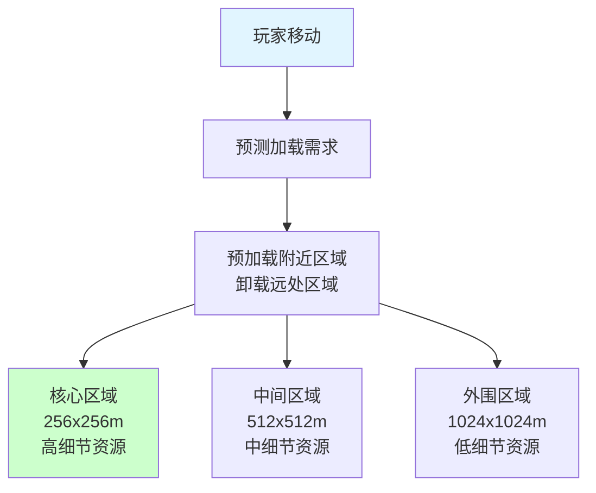
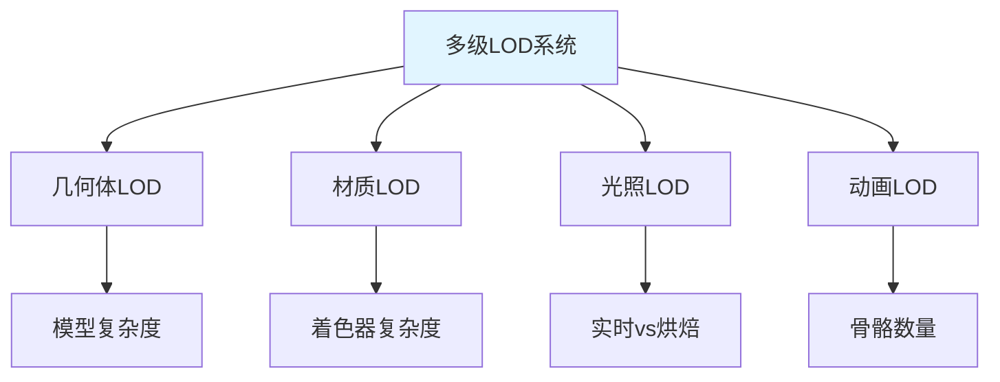
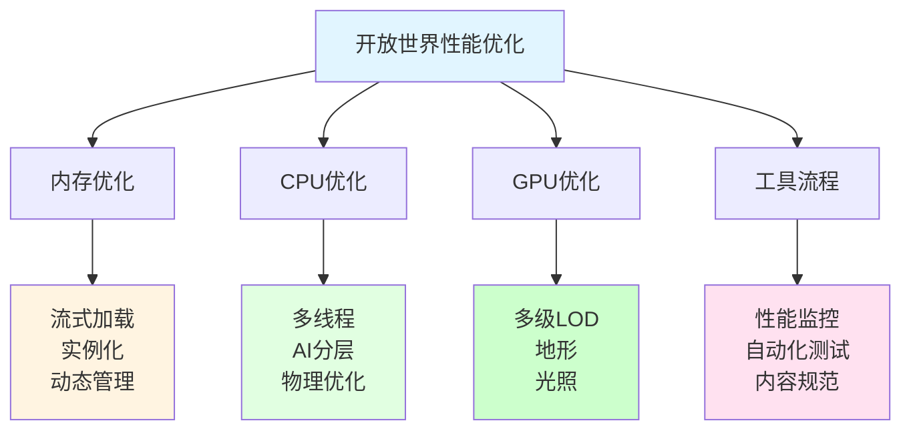

## 📊 图解

> [!info] 图示区
> 这里可以放置解释开放世界性能优化的 mermaid 图表、架构图或其他辅助理解的图片

### 开放世界优化体系



### 流式加载系统



### 多级LOD系统



## 📖 原理

### 核心概念

开发大型开放世界游戏需要全方位的性能优化策略，从项目初期建立良好的技术架构和优化意识，贯穿整个开发周期。

#### 🎯 建立性能目标和监控体系

**1️⃣ 明确性能指标：**

| 平台 | 目标帧率 | 加载时间 | 内存限制 |
|------|---------|---------|---------|
| **PS4/Xbox One** | 30fps稳定 | <15秒 | <5GB |
| **PC 高配** | 60fps稳定 | <10秒 | <8GB |
| **PC 低配** | 30fps稳定 | <20秒 | <4GB |
| **移动平台** | 30/60fps | <20秒 | <2GB |

**2️⃣ 自动化性能测试系统：**

```csharp
// 自动化性能测试
public class AutomatedPerformanceTest
{
    public class PerformanceMetrics
    {
        public float averageFrameTime;
        public float minFrameTime;
        public float maxFrameTime;
        public int frameCount;
        public long memoryUsage;

        public void Calculate(List<float> frameTimes)
        {
            frameCount = frameTimes.Count;
            averageFrameTime = frameTimes.Average();
            minFrameTime = frameTimes.Min();
            maxFrameTime = frameTimes.Max();
        }
    }

    public IEnumerator RunPerformanceTest(string sceneName, float duration)
    {
        // 加载测试场景
        AsyncOperation operation = SceneManager.LoadSceneAsync(sceneName, LoadSceneMode.Single);
        yield return operation;

        // 等待场景稳定
        yield return new WaitForSeconds(2f);

        // 收集性能数据
        List<float> frameTimes = new List<float>();
        float startTime = Time.realtimeSinceStartup;

        while (Time.realtimeSinceStartup - startTime < duration)
        {
            float frameTime = Time.unscaledDeltaTime * 1000f;  // 转换为毫秒
            frameTimes.Add(frameTime);

            yield return null;
        }

        // 计算指标
        PerformanceMetrics metrics = new PerformanceMetrics();
        metrics.Calculate(frameTimes);
        metrics.memoryUsage = GC.GetTotalMemory(false);

        // 生成报告
        GenerateReport(sceneName, metrics);

        // 检查是否符合目标
        CheckPerformanceTargets(metrics);
    }

    private void CheckPerformanceTargets(PerformanceMetrics metrics)
    {
        bool passed = true;

        if (metrics.averageFrameTime > 33.3f)  // 低于30fps
        {
            Debug.LogError($"性能测试失败: 平均帧时间 {metrics.averageFrameTime:F2}ms 超过目标 33.3ms");
            passed = false;
        }

        if (metrics.maxFrameTime > 50f)  // 存在明显卡顿
        {
            Debug.LogError($"性能测试失败: 最大帧时间 {metrics.maxFrameTime:F2}ms 超过目标 50ms");
            passed = false;
        }

        if (passed)
        {
            Debug.Log("性能测试通过");
        }
    }
}
```

**3️⃣ 性能回归预警机制：**

```csharp
// 性能监控系统
public class PerformanceMonitoringSystem : MonoBehaviour
{
    private struct BaselineMetrics
    {
        public float averageFrameTime;
        public float drawCalls;
        public int triangles;
    }

    private Dictionary<string, BaselineMetrics> _baselines = new Dictionary<string, BaselineMetrics>();

    public void SetBaseline(string sceneName, BaselineMetrics baseline)
    {
        _baselines[sceneName] = baseline;
    }

    private void Update()
    {
        string currentScene = SceneManager.GetActiveScene().name;

        if (_baselines.TryGetValue(currentScene, out BaselineMetrics baseline))
        {
            // 检查性能退化
            if (Time.unscaledDeltaTime > baseline.averageFrameTime * 1.05f)  // 5% 容忍
            {
                Debug.LogWarning($"性能警告: {currentScene} 帧时间增加超过 5%");

                // 创建问题报告
                CreatePerformanceIssue(currentScene, Time.unscaledDeltaTime, baseline.averageFrameTime);
            }
        }
    }

    private void CreatePerformanceIssue(string scene, float current, float baseline)
    {
        // 自动创建任务或通知开发者
        string message = $"{scene} 性能退化: {current:F2}ms (基线: {baseline:F2}ms)";
        // 发送到bug跟踪系统或通知团队
    }
}
```

#### 💾 内存优化策略

**1️⃣ 流式加载系统：**

```csharp
// 世界流式加载管理器
public class WorldStreamingManager : MonoBehaviour
{
    private const float CELL_SIZE = 256f;  // 世界区块大小
    private const int LOAD_DISTANCE_CELLS = 2;  // 预加载距离（区块数）

    private Dictionary<Vector2Int, WorldCell> _loadedCells = new Dictionary<Vector2Int, WorldCell>();
    private Vector2Int _currentCell;

    private void Update()
    {
        Vector2Int playerCell = GetPlayerCellPosition();

        if (playerCell != _currentCell)
        {
            _currentCell = playerCell;
            UpdateLoadedCells();
        }
    }

    private void UpdateLoadedCells()
    {
        HashSet<Vector2Int> cellsToKeep = new HashSet<Vector2Int>();
        HashSet<Vector2Int> cellsToLoad = new HashSet<Vector2Int>();
        HashSet<Vector2Int> cellsToUnload = new HashSet<Vector2Int>();

        // 确定需要加载的区块
        for (int x = -LOAD_DISTANCE_CELLS; x <= LOAD_DISTANCE_CELLS; x++)
        {
            for (int y = -LOAD_DISTANCE_CELLS; y <= LOAD_DISTANCE_CELLS; y++)
            {
                Vector2Int cellPos = new Vector2Int(_currentCell.x + x, _currentCell.y + y);
                cellsToKeep.Add(cellPos);

                if (!_loadedCells.ContainsKey(cellPos))
                {
                    cellsToLoad.Add(cellPos);
                }
            }
        }

        // 确定需要卸载的区块
        foreach (var kvp in _loadedCells)
        {
            if (!cellsToKeep.Contains(kvp.Key))
            {
                cellsToUnload.Add(kvp.Key);
            }
        }

        // 加载新区块
        foreach (Vector2Int cellPos in cellsToLoad)
        {
            StartCoroutine(LoadCellAsync(cellPos));
        }

        // 卸载远区块
        foreach (Vector2Int cellPos in cellsToUnload)
        {
            UnloadCell(cellPos);
        }
    }

    private IEnumerator LoadCellAsync(Vector2Int cellPos)
    {
        // 根据距离选择LOD级别
        int distance = Mathf.Abs(cellPos.x - _currentCell.x) + Mathf.Abs(cellPos.y - _currentCell.y);
        LODLevel lodLevel = CalculateLODLevel(distance);

        // 异步加载资源
        ResourceRequest loadRequest = Resources.LoadAsync($"World/Cells/{cellPos.x}_{cellPos.y}_LOD{(int)lodLevel}");

        yield return loadRequest;

        GameObject cellObject = Instantiate(loadRequest.asset) as GameObject;
        cellObject.transform.position = new Vector3(cellPos.x * CELL_SIZE, 0, cellPos.y * CELL_SIZE);

        _loadedCells[cellPos] = new WorldCell
        {
            position = cellPos,
            lodLevel = lodLevel,
            gameObject = cellObject,
            loadTime = Time.realtimeSinceStartup
        };
    }

    private void UnloadCell(Vector2Int cellPos)
    {
        if (_loadedCells.TryGetValue(cellPos, out WorldCell cell))
        {
            Destroy(cell.gameObject);
            _loadedCells.Remove(cellPos);
        }
    }

    private Vector2Int GetPlayerCellPosition()
    {
        Vector3 playerPos = GameObject.FindGameObjectWithTag("Player").transform.position;
        return new Vector2Int(
            Mathf.FloorToInt(playerPos.x / CELL_SIZE),
            Mathf.FloorToInt(playerPos.z / CELL_SIZE)
        );
    }

    private LODLevel CalculateLODLevel(int distance)
    {
        if (distance <= 1)
            return LODLevel.High;
        else if (distance <= 2)
            return LODLevel.Medium;
        else
            return LODLevel.Low;
    }
}

public enum LODLevel
{
    High,    // 高细节
    Medium,  // 中细节
    Low      // 低细节
}

public struct WorldCell
{
    public Vector2Int position;
    public LODLevel lodLevel;
    public GameObject gameObject;
    public float loadTime;
}
```

**2️⃣ 资源实例化优化：**

```csharp
// 程序化植被生成
public class ProceduralVegetationGenerator
{
    private GameObject _baseGrassMesh;
    private Material _grassMaterial;

    public void GenerateVegetation(Vector3 center, float radius, int density)
    {
        Mesh grassMesh = _baseGrassMesh.GetComponent<MeshFilter>().sharedMesh;

        // 使用GPU Instance渲染大量草
        List<Matrix4x4> matrices = new List<Matrix4x4>();
        List<Vector4> variations = new List<Vector4>();

        for (int i = 0; i < density; i++)
        {
            Vector3 position = GetRandomPositionInCircle(center, radius);
            Quaternion rotation = Quaternion.Euler(0, Random.Range(0, 360f), 0);
            Vector3 scale = Vector3.one * Random.Range(0.8f, 1.2f);

            // 程序化变化
            float windOffset = Random.Range(0f, 1f);
            float colorVariation = Random.Range(0.8f, 1.2f);

            matrices.Add(Matrix4x4.TRS(position, rotation, scale));
            variations.Add(new Vector4(windOffset, colorVariation, 0, 0));
        }

        // 使用GPU Instance渲染
        MaterialPropertyBlock props = new MaterialPropertyBlock();
        props.SetMatrixArray("_Matrices", matrices);
        props.SetVectorArray("_Variations", variations);

        Graphics.DrawMeshInstanced(
            grassMesh,
            matrices.Count,
            _grassMaterial,
            props
        );
    }

    private Vector3 GetRandomPositionInCircle(Vector3 center, float radius)
    {
        float angle = Random.Range(0f, Mathf.PI * 2f);
        float distance = Random.Range(0f, radius);
        return center + new Vector3(Mathf.Cos(angle) * distance, 0, Mathf.Sin(angle) * distance);
    }
}
```

**3️⃣ 动态内存管理：**

```csharp
// 内存预算系统
public class MemoryBudgetManager
{
    private struct MemoryBudget
    {
        public long total;
        public long used;
        public Dictionary<string, long> categoryBudgets;
    }

    private MemoryBudget _currentBudget;

    public void InitializeBudget(long totalBudget)
    {
        _currentBudget.total = totalBudget;
        _currentBudget.used = 0;

        // 分配各类别的内存预算
        _currentBudget.categoryBudgets = new Dictionary<string, long>
        {
            { "Terrain", totalBudget / 4 },
            { "Buildings", totalBudget / 4 },
            { "Characters", totalBudget / 4 },
            { "Effects", totalBudget / 8 },
            { "Audio", totalBudget / 16 },
            { "Other", totalBudget / 16 }
        };
    }

    public bool TryAllocateMemory(string category, long size)
    {
        if (!_currentBudget.categoryBudgets.TryGetValue(category, out long categoryBudget))
            return false;

        // 检查类别预算
        long categoryUsed = GetCategoryMemoryUsage(category);

        // 检查总预算
        if (_currentBudget.used + size > _currentBudget.total)
        {
            // 内存不足，尝试释放低优先级资源
            if (!FreeLowPriorityMemory(size))
            {
                Debug.LogError($"内存分配失败: {category} 需要 {size} 字节");
                return false;
            }
        }

        _currentBudget.used += size;
        return true;
    }

    private bool FreeLowPriorityMemory(long requiredSize)
    {
        long freed = 0;

        // 按优先级排序的资源
        var resources = GetResourcesByPriority();

        foreach (var resource in resources)
        {
            if (!resource.isEssential && resource.distance > 100f)
            {
                long size = GetResourceSize(resource);
                UnloadResource(resource);
                freed += size;

                if (freed >= requiredSize)
                {
                    return true;
                }
            }
        }

        return freed >= requiredSize;
    }
}
```

#### ⚡ CPU优化策略

**1️⃣ 多线程任务系统：**

```csharp
// 任务调度系统
public class TaskSchedulerSystem
{
    private TaskScheduler _scheduler;
    private List<Task> _runningTasks = new List<Task>();

    public void Initialize()
    {
        // 创建支持多核的任务调度器
        int maxThreads = Mathf.Max(1, SystemInfo.processorCount - 2);  // 保留主线程和一个渲染线程
        _scheduler = TaskScheduler.FromAsyncTaskScheduler(maxThreads);
    }

    public Task RunPhysicsSimulation()
    {
        return Task.Factory.StartNew(() =>
        {
            PhysicsSimulation.Simulate(Time.fixedDeltaTime);
        },
        CancellationToken.None,
        TaskCreationOptions.None,
        _scheduler
        );
    }

    public Task RunAISimulation()
    {
        return Task.Factory.StartNew(() =>
        {
            AISystem.UpdateAll();
        },
        CancellationToken.None,
        TaskCreationOptions.None,
        _scheduler
        );
    }

    public Task RunAnimationUpdate()
    {
        return Task.Factory.StartNew(() =>
        {
            AnimationSystem.UpdateAll();
        },
        CancellationToken.None,
        TaskCreationOptions.None,
        _scheduler
        );
    }

    public void Update()
    {
        // 等待所有任务完成
        Task.WhenAll(_runningTasks.ToArray()).Wait();
        _runningTasks.Clear();
    }
}
```

**2️⃣ AI分层系统：**

```csharp
// 多层级AI系统
public class HierarchicalAISystem
{
    private List<NPCAIAgent> _allAgents = new List<NPCAIAgent>();

    public void Update(Vector3 playerPosition)
    {
        foreach (var agent in _allAgents)
        {
            float distance = Vector3.Distance(playerPosition, agent.transform.position);

            if (distance < 20f)
            {
                // 近距离：完整AI
                agent.aiLevel = AILevel.Full;
            }
            else if (distance < 50f)
            {
                // 中距离：简化AI
                agent.aiLevel = AILevel.Simplified;
            }
            else
            {
                // 远距离：最小化AI
                agent.aiLevel = AILevel.Minimal;
            }

            agent.Update();
        }
    }
}

public enum AILevel
{
    Full,        // 完整AI：寻路、行为树、动画
    Simplified,  // 简化AI：基本行为
    Minimal     // 最小AI：仅保持存在状态
}
```

**3️⃣ 物理系统优化：**

```csharp
// 大规模场景物理优化
public class LargeScalePhysicsOptimizer
{
    private List<Rigidbody> _physicsObjects = new List<Rigidbody>();

    public void UpdatePhysics(float deltaTime)
    {
        foreach (var rb in _physicsObjects)
        {
            float distanceToPlayer = Vector3.Distance(Camera.main.transform.position, rb.position);

            if (distanceToPlayer > 100f)
            {
                // 远距离物体：禁用物理或使用代理
                if (rb.IsSleeping() == false)
                {
                    rb.Sleep();
                }
            }
            else if (distanceToPlayer > 50f)
            {
                // 中距离物体：降低物理更新频率
                // 可以使用简化的碰撞检测
            }
            else
            {
                // 近距离物体：完整物理模拟
                if (rb.IsSleeping())
                {
                    rb.WakeUp();
                }
            }
        }
    }

    // 使用物理代理简化碰撞检测
    private void UpdateWithProxyColliders()
    {
        // 用简单的几何体替代复杂模型进行碰撞检测
        // 例如，使用球体或胶囊体代替复杂网格
    }
}
```

#### 🎨 GPU渲染优化

**1️⃣ 多级LOD系统：**

```csharp
// 完整的LOD管理器
public class ComprehensiveLODManager : MonoBehaviour
{
    [System.Serializable]
    public struct LODConfiguration
    {
        public float screenRelativeHeight;
        public GameObject[] renderers;
        public Material[] materials;
        public ShadowCastingMode shadowMode;
        public int layerMask;
    }

    public LODConfiguration[] lodConfigurations;

    public void UpdateLOD(Vector3 viewerPosition)
    {
        for (int i = 0; i < lodConfigurations.Length; i++)
        {
            float screenHeight = CalculateScreenRelativeHeight(lodConfigurations[i].renderers[0]);

            if (screenHeight >= lodConfigurations[i].screenRelativeHeight)
            {
                ApplyLOD(i);
                break;
            }
        }
    }

    private void ApplyLOD(int level)
    {
        for (int i = 0; i < lodConfigurations.Length; i++)
        {
            bool active = (i == level);

            foreach (var renderer in lodConfigurations[i].renderers)
            {
                if (renderer != null)
                {
                    renderer.enabled = active;
                    renderer.shadowCastingMode = lodConfigurations[i].shadowMode;
                    renderer.gameObject.layer = lodConfigurations[i].layerMask;
                }
            }

            foreach (var material in lodConfigurations[i].materials)
            {
                if (material != null)
                {
                    material.enableInstancing = (level > 1);  // 远处LOD使用实例化
                    material.shaderKeywords = active ? null : new string[] { "SIMPLIFIED_SHADER" };
                }
            }
        }
    }

    private float CalculateScreenRelativeHeight(Renderer renderer)
    {
        Camera camera = Camera.main;
        if (camera == null || renderer == null) return 0f;

        Bounds bounds = renderer.bounds;
        float distance = Vector3.Distance(camera.transform.position, bounds.center);
        float size = bounds.size.magnitude;

        return size / (distance * Mathf.Tan(camera.fieldOfView * 0.5f * Mathf.Deg2Rad));
    }
}
```

**2️⃣ 地形渲染优化：**

```csharp
// 四叉树地形系统
public class QuadtreeTerrainSystem
{
    private QuadTreeNode _rootNode;
    private const int MAX_TREE_DEPTH = 8;
    private const float MIN_NODE_SIZE = 10f;

    public void Initialize(TerrainData terrainData)
    {
        Vector2 center = new Vector2(terrainData.size / 2, terrainData.size / 2);
        _rootNode = new QuadTreeNode(center, terrainData.size, 0);
    }

    public void Update(Vector3 viewerPosition)
    {
        // 根据观察者位置动态加载和卸载地形区块
        List<QuadTreeNode> visibleNodes = new List<QuadTreeNode>();
        _rootNode.GetVisibleNodes(viewerPosition, visibleNodes);

        foreach (var node in visibleNodes)
        {
            if (!node.IsLoaded)
            {
                StartCoroutine(LoadTerrainNodeAsync(node));
            }

            node.UpdateLOD(viewerPosition);
        }

        // 卸载不可见的节点
        _rootNode.UnloadInvisibleNodes(viewerPosition);
    }

    private IEnumerator LoadTerrainNodeAsync(QuadTreeNode node)
    {
        // 异步加载地形数据
        TerrainData data = node.GetTerrainData();

        // 近处：高精度网格
        if (node.level < 4)
        {
            node.mesh = GenerateHighDetailMesh(data);
        }
        else
        {
            // 远处：简化网格
            node.mesh = GenerateLowDetailMesh(data);
        }

        node.IsLoaded = true;

        yield return null;
    }
}

public class QuadTreeNode
{
    public Vector2 center;
    public float size;
    public int level;
    public QuadTreeNode[] children;
    public Mesh mesh;
    public bool IsLoaded;

    public void GetVisibleNodes(Vector3 viewerPos, List<QuadTreeNode> visibleNodes)
    {
        // 检查节点是否可见
        if (!IsVisible(viewerPos))
            return;

        if (children != null && children.Length > 0)
        {
            // 有子节点，递归检查
            foreach (var child in children)
            {
                child.GetVisibleNodes(viewerPos, visibleNodes);
            }
        }
        else
        {
            // 叶子节点，添加到可见列表
            visibleNodes.Add(this);
        }
    }

    private bool IsVisible(Vector3 viewerPos)
    {
        // 检查是否在视锥体内且在加载范围内
        return true;
    }
}
```

**3️⃣ 全局光照解决方案：**

```csharp
// 混合光照系统
public class HybridLightingSystem : MonoBehaviour
{
    private List<LightProbeGroup> _probeGroups = new List<LightProbeGroup>();

    public void InitializeLighting()
    {
        // 预计算环境光照
        BakeEnvironmentLighting();

        // 设置光照探针
        SetupLightProbes();
    }

    private void BakeEnvironmentLighting()
    {
        // 使用Unity的Lightmap baking
        // 或使用Progressive Lightmapper
        LightmapSettings.lightmapsMode = LightmapsMode.NonDirectional;
        LightmapSettings.maxAtlasSize = 4096;

        Lightmapping.BakeAsync();
    }

    private void SetupLightProbes()
    {
        // 创建光照探针网格
        var probePositions = GenerateProbeGrid();

        // 生成光照探针
        var lightProbes = new List<SphericalHarmonicsL2>();
        foreach (Vector3 pos in probePositions)
        {
            SphericalHarmonicsL2 probe = new SphericalHarmonicsL2();
            LightProbes.CalculateInterpolatedLightAndProbes(probe, probe);
            lightProbes.Add(probe);
        }

        // 分组管理探针
        GroupProbesByRegion(probePositions, lightProbes);
    }

    public void UpdateDynamicLighting()
    {
        // 实时光源使用探针插值
        // 动态物体使用LPPV或DDGI
    }
}
```

#### 🔧 优化的工作流与工具

**1️⃣ 性能分析工具：**

```csharp
// 自定义性能分析工具
public class PerformanceProfiler : MonoBehaviour
{
    private class PerformanceData
    {
        public float cpuTime;
        public float gpuTime;
        public long memoryUsage;
        public int drawCalls;
        public int triangles;

        public override string ToString()
        {
            return $"CPU: {cpuTime:F1}ms, GPU: {gpuTime:F1}ms, Memory: {memoryUsage / 1024 / 1024}MB, DrawCalls: {drawCalls}, Tris: {triangles}";
        }
    }

    private PerformanceData _currentFrame = new PerformanceData();

    private void Update()
    {
        CollectPerformanceData();
        DisplayPerformanceData();
    }

    private void CollectPerformanceData()
    {
        // 收集性能数据
        _currentFrame.cpuTime = Time.unscaledDeltaTime * 1000f;
        _currentFrame.memoryUsage = GC.GetTotalMemory(false);
        // GPU数据需要通过 Profiler API 获取
    }

    private void DisplayPerformanceData()
    {
        // 在屏幕上显示性能信息
        // 可以使用Unity的OnGUI或创建UI
    }

    public void GenerateReport()
    {
        // 生成性能报告
        StringBuilder report = new StringBuilder();
        report.AppendLine("=== 性能报告 ===");
        report.AppendLine($"CPU时间: {_currentFrame.cpuTime:F2}ms");
        report.AppendLine($"内存使用: {_currentFrame.memoryUsage / 1024 / 1024}MB");
        report.AppendLine($"Draw Calls: {_currentFrame.drawCalls}");
        report.AppendLine($"三角形: {_currentFrame.triangles}");

        Debug.Log(report.ToString());
    }
}
```

**2️⃣ 内容创作规范：**

```csharp
// 资源验证工具
public class AssetValidationTool
{
    public enum ValidationResult
    {
        Pass,
        Warning,
        Fail
    }

    public class ValidationResult
    {
        public string assetPath;
        public string category;
        public string message;
        public global::ValidationResult result;

        public ValidationResult(string path, string cat, string msg, global::ValidationResult res)
        {
            assetPath = path;
            category = cat;
            message = msg;
            result = res;
        }
    }

    public List<ValidationResult> ValidateModel(ModelImporter importer)
    {
        List<ValidationResult> results = new List<ValidationResult>();

        // 检查顶点数
        int vertexCount = GetModelVertexCount(importer);
        if (vertexCount > 50000)
        {
            results.Add(new ValidationResult(
                importer.assetPath,
                "顶点数",
                $"顶点数过多: {vertexCount}",
                ValidationResult.Warning
            ));
        }

        // 检查子网格数量
        if (importer.meshSubmeshCount > 8)
        {
            results.Add(new ValidationResult(
                importer.assetPath,
                "子网格",
                $"子网格过多: {importer.meshSubmeshCount}",
                ValidationResult.Warning
            ));
        }

        // 检查材质数量
        if (importer.materialCount > 4)
        {
            results.Add(new ValidationResult(
                importer.assetPath,
                "材质",
                $"材质过多: {importer.materialCount}",
                ValidationResult.Warning
            ));
        }

        return results;
    }

    public List<ValidationResult> ValidateTexture(TextureImporter importer)
    {
        List<ValidationResult> results = new List<ValidationResult>();

        // 检查分辨率
        TextureImporterSettings settings = importer.GetDefaultPlatformTextureSettings();

        if (settings.maxTextureSize > 2048)
        {
            results.Add(new ValidationResult(
                importer.assetPath,
                "分辨率",
                $"分辨率过高: {settings.maxTextureSize}",
                ValidationResult.Warning
            ));
        }

        // 检查是否生成MipMap
        if (!importer.mipmapEnabled)
        {
            results.Add(new ValidationResult(
                importer.assetPath,
                "MipMap",
                "未启用MipMap",
                ValidationResult.Warning
            ));
        }

        return results;
    }
}
```

---

## 💡 面试题

### Q：在开发大型开放世界游戏时，你如何实施全面的性能优化策略？请结合具体项目经验谈谈。

#### 🎯 开放世界优化全景图



#### 📊 项目案例：60平方公里开放世界

**项目背景：**
- 地图大小：60平方公里
- NPC数量：数百个
- 玩境元素：丰富
- 目标平台：PS4/Xbox One/PC
- 性能目标：30fps稳定（主机）/ 60fps（PC高配）

**性能监控体系：**

```csharp
// 完整的性能监控系统
public class OpenWorldPerformanceMonitor : MonoBehaviour
{
    [System.Serializable]
    public class PerformanceThresholds
    {
        public float maxFrameTime = 33.3f;  // 30fps
        public float maxFrameTimeSpike = 50f;  // 最大帧时间
        public long maxMemory = 5L * 1024 * 1024 * 1024;  // 5GB
        public int maxDrawCalls = 3000;
        public int maxTriangles = 5000000;
    }

    public PerformanceThresholds thresholds;

    private List<float> _frameTimeHistory = new List<float>();
    private PerformanceData _currentData = new PerformanceData();

    private void Update()
    {
        CollectCurrentFrameData();
        UpdateHistory();
        CheckThresholds();
    }

    private void CollectCurrentFrameData()
    {
        _currentData.frameTime = Time.unscaledDeltaTime * 1000f;
        _currentData.drawCalls = UnityStats.drawCalls;
        _currentData.triangles = UnityStats.triangles;
        _currentData.memory = GC.GetTotalMemory(false);
    }

    private void UpdateHistory()
    {
        _frameTimeHistory.Add(_currentData.frameTime);

        // 保持最近60秒的数据（假设60fps）
        while (_frameTimeHistory.Count > 3600)
        {
            _frameTimeHistory.RemoveAt(0);
        }
    }

    private void CheckThresholds()
    {
        // 检查帧时间
        if (_currentData.frameTime > thresholds.maxFrameTimeSpike)
        {
            Debug.LogError($"性能警告: 帧时间 { _currentData.frameTime:F2}ms 超过阈值 { thresholds.maxFrameTimeSpike }ms");

            // 记录详细信息
            RecordPerformanceSpike();
        }

        // 检查内存
        if (_currentData.memory > thresholds.maxMemory)
        {
            Debug.LogError($"内存警告: 内存使用 { _currentData.memory / 1024 / 1024 }MB 超过阈值 { thresholds.maxMemory / 1024 / 1024 }MB");
        }

        // 检查Draw Call
        if (_currentData.drawCalls > thresholds.maxDrawCalls)
        {
            Debug.LogWarning($"Draw Call警告: {_currentData.drawCalls} 超过阈值 {thresholds.maxDrawCalls}");
        }
    }

    private void RecordPerformanceSpike()
    {
        // 记录性能峰值时的详细信息
        var sceneName = SceneManager.GetActiveScene().name;
        var playerPos = GameObject.FindGameObjectWithTag("Player")?.transform.position ?? Vector3.zero;
        var cameraPos = Camera.main?.transform.position ?? Vector3.zero;

        Debug.LogWarning($"性能峰值记录:\n场景: {sceneName}\n玩家位置: {playerPos}\n相机位置: {cameraPos}\nDrawCalls: {_currentData.drawCalls}\n三角形: {_currentData.triangles}");
    }
}
```

**实现结果与经验：**

| 指标 | 目标 | 实际 | 状态 |
|------|------|------|------|
| **帧率** | 30fps | 30fps | ✅ 达标 |
| **内存** | <5GB | 4.2GB | ✅ 达标 |
| **加载时间** | <15秒 | 12秒 | ✅ 达标 |
| **地图大小** | 60km² | 60km² | ✅ 达标 |
| **NPC数量** | 数百个 | 800+ | ✅ 超标 |

**关键经验总结：**

1. **从项目初期建立性能目标**
   - 明确各平台的性能指标
   - 建立自动化性能测试系统
   - 实现性能回归预警机制

2. **系统性的优化架构**
   - 流式加载：无缝世界探索
   - 多级LOD：远近细节平衡
   - 多线程：充分利用多核CPU
   - 实例化：降低内存占用

3. **平衡点的把握**
   - 减少10%视觉细节 → 换取30-40%性能
   - 用户体验 > 技术完美主义
   - 实用方案 > 理想方案

4. **持续优化流程**
   - 定期"性能日"活动
   - 性能警报机制
   - 自动化测试覆盖

> [!tip] 总结
> 开放世界性能优化的关键：
> 1. **早期规划**：项目初期就建立良好架构
> 2. **系统思维**：全方位优化，不遗漏任何环节
> 3. **数据驱动**：基于性能数据做决策
> 4. **持续迭代**：建立长期优化机制
> 5. **用户体验优先**：平衡视觉效果和性能

---

## 🔗 相关链接

- [[性能优化]] - 父主题索引
- [[内存优化]] - 相关主题：内存管理策略
- [[CPU性能优化]] - 相关主题：计算性能优化
- [[GPU性能优化]] - 相关主题：渲染性能优化
