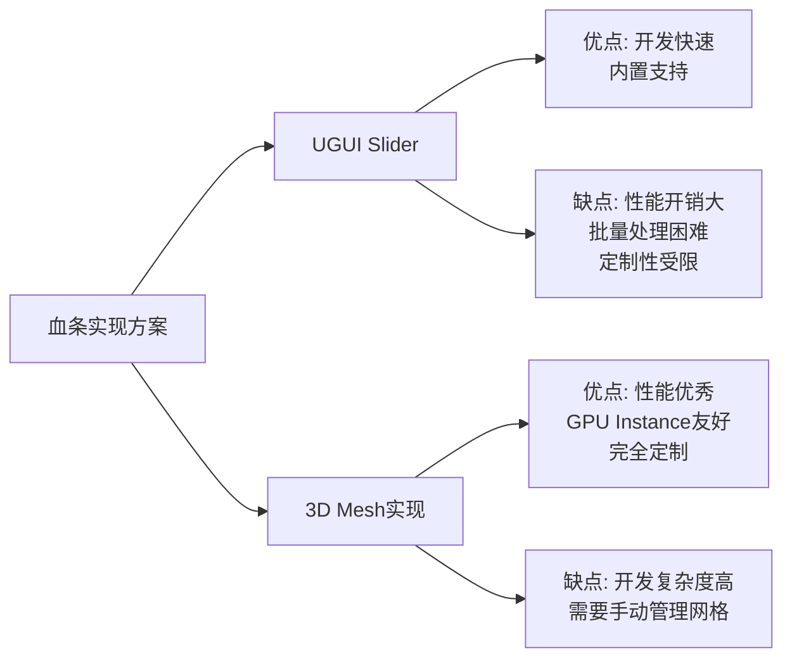
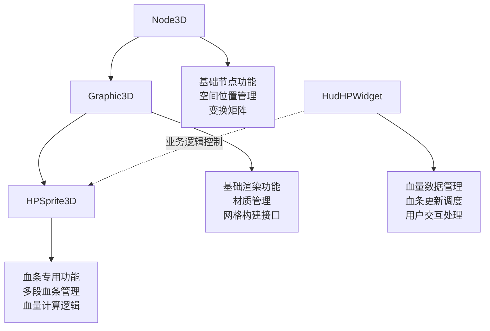
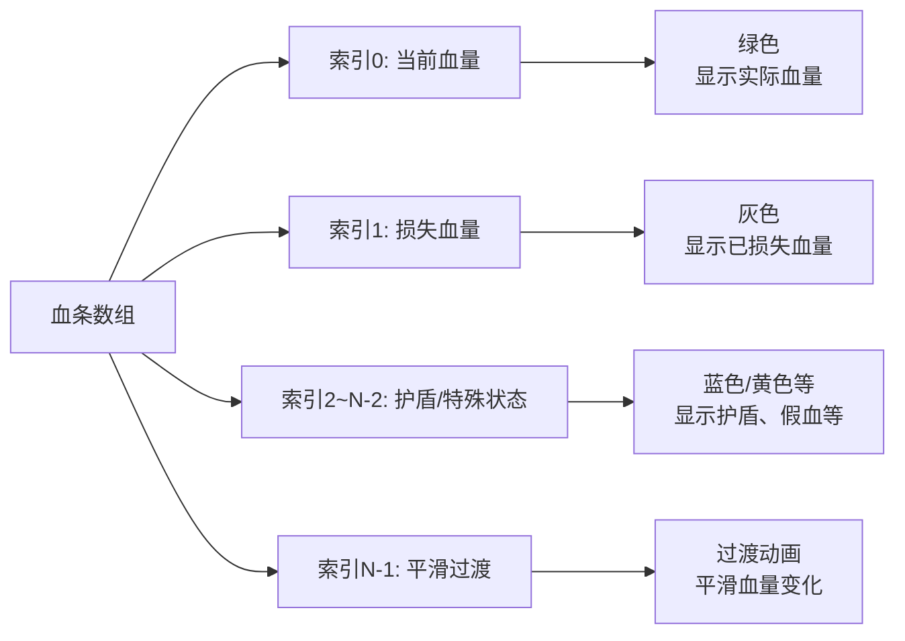
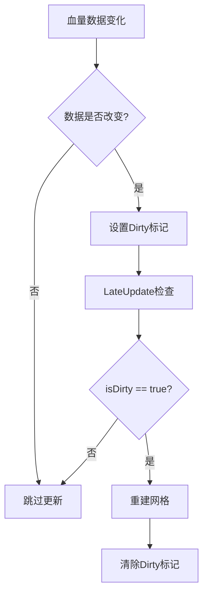

# 血条系统实现

## 核心概念

血条系统是通过Unity的3D网格（Mesh）加Material实现的，而不是使用UGUI的Slider。通过计算顶点位置、UV坐标和颜色来构建3D网格，实现了灵活、高效、可定制的血条显示方案。

## 技术选型对比



## 系统架构

### 三层继承架构



### 代码架构示例

```csharp
// 基础节点类
public class Node3D : MonoBehaviour
{
    protected Transform cachedTransform;
    protected virtual void Awake()
    {
        cachedTransform = transform;
    }

    public virtual void SetPosition(Vector3 position)
    {
        cachedTransform.position = position;
    }
}

// 基础渲染类
public class Graphic3D : Node3D
{
    protected MeshRenderer meshRenderer;
    protected MeshFilter meshFilter;
    protected Material material;

    protected virtual void Awake()
    {
        base.Awake();
        meshFilter = GetComponent<MeshFilter>();
        meshRenderer = GetComponent<MeshRenderer>();

        if (meshFilter == null)
        {
            meshFilter = gameObject.AddComponent<MeshFilter>();
        }

        if (meshRenderer == null)
        {
            meshRenderer = gameObject.AddComponent<MeshRenderer>();
        }
    }

    protected virtual void UpdateMesh(Mesh mesh, Material material)
    {
        meshFilter.sharedMesh = mesh;
        meshRenderer.sharedMaterial = material;
    }
}

// 血条专用渲染类
public class HPSprite3D : Graphic3D
{
    [SerializeField]
    private HPSprite3DPart[] parts;

    private Mesh hpMesh;
    private bool isDirty = false;

    // 血条部分定义
    [System.Serializable]
    public class HPSprite3DPart
    {
        public Color color = Color.white;
        public float percent = 1f;
        public string partName;
    }

    public void SetHPData(float currentHP, float maxHP)
    {
        UpdatePartsData(currentHP, maxHP);
        isDirty = true;
    }

    private void LateUpdate()
    {
        if (isDirty)
        {
            RebuildMesh();
            isDirty = false;
        }
    }

    private void RebuildMesh()
    {
        if (hpMesh == null)
        {
            hpMesh = new Mesh();
            hpMesh.name = "HPBar_Mesh";
        }

        // 生成顶点、三角形、UV、颜色数据
        List<Vector3> vertices = new List<Vector3>();
        List<int> triangles = new List<int>();
        List<Vector2> uvs = new List<Vector2>();
        List<Color> colors = new List<Color>();

        GenerateMeshData(vertices, triangles, uvs, colors);

        hpMesh.Clear();
        hpMesh.SetVertices(vertices);
        hpMesh.SetTriangles(triangles, 0);
        hpMesh.SetUVs(0, uvs);
        hpMesh.SetColors(colors);

        hpMesh.RecalculateNormals();
        hpMesh.RecalculateBounds();

        UpdateMesh(hpMesh, material);
    }
}
```

## 多段血条系统

### 血条分段结构



### 血条部分配置

```csharp
// 血条部分配置示例
private void ConfigureHPParts()
{
    HPSprite3DPart[] parts = new HPSprite3DPart[5];

    // 当前血量（绿色）
    parts[0] = new HPSprite3DPart
    {
        color = new Color(0.2f, 0.8f, 0.2f),
        percent = 1.0f,
        partName = "CurrentHP"
    };

    // 损失血量（灰色）
    parts[1] = new HPSprite3DPart
    {
        color = new Color(0.3f, 0.3f, 0.3f),
        percent = 0.0f,
        partName = "LostHP"
    };

    // 护盾（蓝色）
    parts[2] = new HPSprite3DPart
    {
        color = new Color(0.3f, 0.6f, 1.0f),
        percent = 0.2f,
        partName = "Shield"
    };

    // 假血（黄色）
    parts[3] = new HPSprite3DPart
    {
        color = new Color(1.0f, 0.8f, 0.2f),
        percent = 0.15f,
        partName = "FakeHP"
    };

    // 平滑过渡
    parts[4] = new HPSprite3DPart
    {
        color = new Color(0.4f, 0.9f, 0.4f),
        percent = 0.0f,
        partName = "Transition"
    };
}
```

### 网格生成算法

```csharp
private void GenerateMeshData(
    List<Vector3> vertices,
    List<int> triangles,
    List<Vector2> uvs,
    List<Color> colors)
{
    float currentX = 0f;
    float barHeight = 0.5f;
    float barDepth = 0.1f;

    for (int i = 0; i < parts.Length; i++)
    {
        if (parts[i].percent <= 0f)
            continue;

        float partWidth = parts[i].percent * totalWidth;

        // 为每个部分创建4个顶点（四边形）
        int vertexIndex = vertices.Count;

        // 左下角
        vertices.Add(new Vector3(currentX, 0, 0));
        uvs.Add(new Vector2(0, 0));
        colors.Add(parts[i].color);

        // 右下角
        vertices.Add(new Vector3(currentX + partWidth, 0, 0));
        uvs.Add(new Vector2(1, 0));
        colors.Add(parts[i].color);

        // 左上角
        vertices.Add(new Vector3(currentX, barHeight, 0));
        uvs.Add(new Vector2(0, 1));
        colors.Add(parts[i].color);

        // 右上角
        vertices.Add(new Vector3(currentX + partWidth, barHeight, 0));
        uvs.Add(new Vector2(1, 1));
        colors.Add(parts[i].color);

        // 定义两个三角形组成四边形
        triangles.Add(vertexIndex + 0);
        triangles.Add(vertexIndex + 2);
        triangles.Add(vertexIndex + 1);

        triangles.Add(vertexIndex + 1);
        triangles.Add(vertexIndex + 2);
        triangles.Add(vertexIndex + 3);

        currentX += partWidth;
    }
}
```

## 性能优化策略

### 1. 脏标记系统



```csharp
public class HPSprite3D : Graphic3D
{
    private bool isDirty = false;
    private float lastHP = -1f;
    private float lastMaxHP = -1f;

    public void SetHPData(float currentHP, float maxHP)
    {
        // 只在数据实际改变时设置脏标记
        if (!Mathf.Approximately(currentHP, lastHP) ||
            !Mathf.Approximately(maxHP, lastMaxHP))
        {
            lastHP = currentHP;
            lastMaxHP = maxHP;

            UpdatePartsData(currentHP, maxHP);
            isDirty = true;
        }
    }

    private void LateUpdate()
    {
        if (isDirty)
        {
            RebuildMesh();
            isDirty = false;
        }
    }
}
```

### 2. 网格数据复用

```csharp
public class HPSprite3DMeshPool
{
    private static Dictionary<int, Mesh> meshPool = new Dictionary<int, Mesh>();
    private const int MAX_POOL_SIZE = 100;

    public static Mesh GetMesh(int vertexCount)
    {
        // 查找合适大小的网格
        foreach (var kvp in meshPool)
        {
            if (kvp.Key >= vertexCount && !kvp.Value)
            {
                return kvp.Value;
            }
        }

        // 创建新网格
        Mesh newMesh = new Mesh();
        newMesh.name = $"HPBar_Mesh_{vertexCount}";

        if (meshPool.Count < MAX_POOL_SIZE)
        {
            meshPool[vertexCount] = newMesh;
        }

        return newMesh;
    }

    public static void ClearPool()
    {
        foreach (var mesh in meshPool.Values)
        {
            if (mesh != null)
            {
                DestroyImmediate(mesh);
            }
        }
        meshPool.Clear();
    }
}
```

### 3. GPU Instance优化

```csharp
// 使用GPU Instance批量渲染血条
public class HPSprite3D : Graphic3D
{
    private MaterialPropertyBlock propertyBlock;
    private static List<HPSprite3D> allHPBars = new List<HPSprite3D>();

    protected virtual void Awake()
    {
        base.Awake();
        propertyBlock = new MaterialPropertyBlock();
        allHPBars.Add(this);
    }

    private void OnDestroy()
    {
        allHPBars.Remove(this);
    }

    // 批量更新所有血条的颜色数据
    public static void UpdateAllColors()
    {
        foreach (var hpBar in allHPBars)
        {
            hpBar.UpdatePropertyBlock();
        }
    }

    private void UpdatePropertyBlock()
    {
        if (meshRenderer == null) return;

        meshRenderer.GetPropertyBlock(propertyBlock);

        // 设置血条颜色到Shader
        for (int i = 0; i < parts.Length; i++)
        {
            propertyBlock.SetColor($"_PartColor{i}", parts[i].color);
            propertyBlock.SetFloat($"_PartPercent{i}", parts[i].percent);
        }

        meshRenderer.SetPropertyBlock(propertyBlock);
    }
}
```

## 边界条件处理

### 低血量显示

```csharp
private void HandleLowHPState(float currentHP, float maxHP)
{
    float hpPercent = currentHP / maxHP;

    // 低血量状态警告
    if (hpPercent < 0.3f)
    {
        // 添加闪烁效果
        if (Time.time % 0.5f < 0.25f)
        {
            SetPartColor(0, Color.red);
        }
        else
        {
            SetPartColor(0, new Color(1f, 0.5f, 0.5f));
        }
    }
    // 中等血量
    else if (hpPercent < 0.6f)
    {
        SetPartColor(0, new Color(1f, 1f, 0.2f)); // 黄色
    }
    // 正常血量
    else
    {
        SetPartColor(0, new Color(0.2f, 0.8f, 0.2f)); // 绿色
    }

    // 确保至少显示最小宽度
    if (hpPercent < 0.01f && currentHP > 0)
    {
        SetPartPercent(0, 0.01f); // 最小1%显示
    }
}
```

### 刻度系统

```csharp
public class HPSprite3D : Graphic3D
{
    [SerializeField]
    private bool showScaleMarks = true;

    [SerializeField]
    private int scaleMarkCount = 10;

    private void GenerateScaleMarks(List<Vector3> vertices, List<int> triangles)
    {
        if (!showScaleMarks) return;

        float markWidth = 0.02f;
        float markHeight = 0.1f;
        float interval = 1f / scaleMarkCount;

        for (int i = 0; i <= scaleMarkCount; i++)
        {
            float xPos = i * interval * totalWidth;

            // 添加刻度标记的顶点
            int vertexIndex = vertices.Count;

            vertices.Add(new Vector3(xPos - markWidth / 2, 0, 0));
            vertices.Add(new Vector3(xPos + markWidth / 2, 0, 0));
            vertices.Add(new Vector3(xPos - markWidth / 2, markHeight, 0));
            vertices.Add(new Vector3(xPos + markWidth / 2, markHeight, 0));

            // 添加三角形
            triangles.Add(vertexIndex + 0);
            triangles.Add(vertexIndex + 2);
            triangles.Add(vertexIndex + 1);

            triangles.Add(vertexIndex + 1);
            triangles.Add(vertexIndex + 2);
            triangles.Add(vertexIndex + 3);
        }
    }
}
```

## 业务逻辑层

### 血量控制器

```csharp
public class HudHPWidget : MonoBehaviour
{
    [SerializeField]
    private HPSprite3D hpSprite3D;

    private CharacterStats characterStats;

    private void Start()
    {
        characterStats = GetComponent<CharacterStats>();

        if (characterStats != null)
        {
            characterStats.OnHPChanged += HandleHPChanged;
        }

        // 初始化血条显示
        UpdateHPDisplay();
    }

    private void OnDestroy()
    {
        if (characterStats != null)
        {
            characterStats.OnHPChanged -= HandleHPChanged;
        }
    }

    private void HandleHPChanged(float newHP, float maxHP)
    {
        UpdateHPDisplay();
    }

    private void UpdateHPDisplay()
    {
        if (hpSprite3D != null && characterStats != null)
        {
            hpSprite3D.SetHPData(characterStats.CurrentHP, characterStats.MaxHP);
        }
    }

    // 显示/隐藏血条
    public void SetHPBarVisible(bool visible)
    {
        if (hpSprite3D != null)
        {
            hpSprite3D.gameObject.SetActive(visible);
        }
    }
}
```

## Shader实现

### 血条Shader示例

```hlsl
Shader "Custom/HPBar"
{
    Properties
    {
        _MainTex ("Texture", 2D) = "white" {}

        // 各段血条颜色
        _PartColor0 ("Part 0 Color", Color) = (0.2, 0.8, 0.2, 1)
        _PartColor1 ("Part 1 Color", Color) = (0.3, 0.3, 0.3, 1)
        _PartColor2 ("Part 2 Color", Color) = (0.3, 0.6, 1.0, 1)

        // 各段血条百分比
        _PartPercent0 ("Part 0 Percent", Range(0, 1)) = 1
        _PartPercent1 ("Part 1 Percent", Range(0, 1)) = 0
        _PartPercent2 ("Part 2 Percent", Range(0, 1)) = 0
    }

    SubShader
    {
        Tags { "RenderType"="Transparent" "Queue"="Transparent" }
        LOD 100

        Pass
        {
            Blend SrcAlpha OneMinusSrcAlpha
            ZWrite Off
            Cull Off

            CGPROGRAM
            #pragma vertex vert
            #pragma fragment frag
            #include "UnityCG.cginc"

            struct appdata
            {
                float4 vertex : POSITION;
                float2 uv : TEXCOORD0;
                float4 color : COLOR;
            };

            struct v2f
            {
                float2 uv : TEXCOORD0;
                float4 vertex : SV_POSITION;
                float4 color : COLOR;
            };

            sampler2D _MainTex;
            float4 _MainTex_ST;

            v2f vert (appdata v)
            {
                v2f o;
                o.vertex = UnityObjectToClipPos(v.vertex);
                o.uv = TRANSFORM_TEX(v.uv, _MainTex);
                o.color = v.color;
                return o;
            }

            fixed4 frag (v2f i) : SV_Target
            {
                // 使用顶点颜色
                fixed4 col = i.color;

                // 可选：叠加纹理
                // fixed4 texCol = tex2D(_MainTex, i.uv);
                // col *= texCol;

                return col;
            }
            ENDCG
        }
    }
}
```

## 面试题解析

### Q1: 血条系统是如何实现的？

**核心要点：**
1. ✅ 使用3D Mesh + Material实现，而非UGUI Slider
2. ✅ 三层架构：Node3D → Graphic3D → HPSprite3D
3. ✅ 多段血条系统，支持不同颜色和百分比
4. ✅ 脏标记系统优化性能
5. ✅ 网格数据复用，减少GC压力

**技术优势：**
- 性能优秀，支持GPU Instance批量渲染
- 完全可定制，灵活实现各种血条效果
- 与3D场景无缝集成
- 支持大量血条同时显示

### Q2: 如何处理血条的性能问题？

**优化策略：**
1. **脏标记系统** - 只在数据改变时更新
2. **网格复用** - 减少内存分配和GC
3. **GPU Instance** - 批量渲染多个血条
4. **LOD系统** - 远距离使用简化血条
5. **剔除优化** - 不在屏幕内不更新

### Q3: 多段血条如何管理？

**管理策略：**
1. 数组存储各段数据（颜色、百分比）
2. 按顺序计算各段位置和宽度
3. 支持动态添加/移除血条段
4. 每段独立配置颜色和效果
5. 支持特殊效果（过渡、闪烁等）

## 相关链接

### Unity文档
- [Unity Mesh Documentation](https://docs.unity3d.com/ScriptReference/Mesh.html)
- [Unity GPU Instancing](https://docs.unity3d.com/Manual/GPUInstancing.html)
- [MaterialPropertyBlock](https://docs.unity3d.com/ScriptReference/MaterialPropertyBlock.html)

### 相关技术
- [Mesh Optimization](https://blog.unity.com/technology/mesh-optimization)
- [Performance Best Practices](https://docs.unity3d.com/Manual/BestPracticeUnderstandingPerformanceInUnity.html)

### 扩展阅读
- [UI Toolkit vs UGUI](https://docs.unity3d.com/Manual/UIElements-vs-UGUI.html)
- [Custom UI Components](https://docs.unity3d.com/Manual/UIE-Custom-Controls.html)
