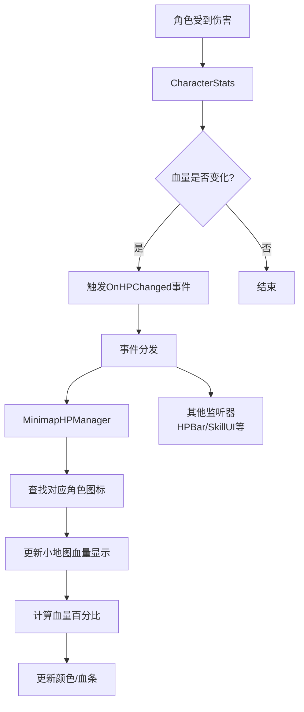
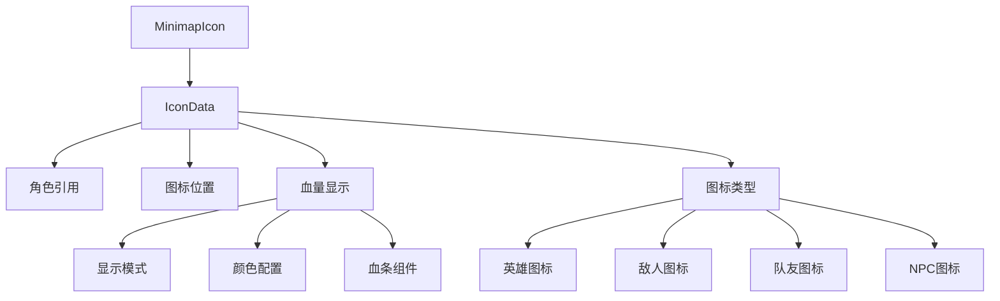
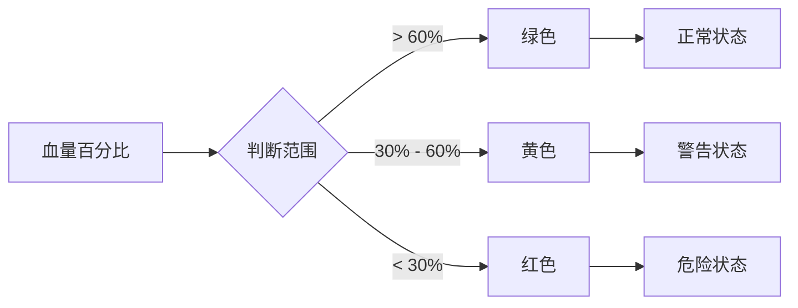

# 小地图系统

## 核心概念

小地图血量显示功能通过事件监听机制实现，当角色血量发生变化时触发事件，小地图模块监听该事件并更新对应角色图标的血量显示。这种松耦合的设计确保了系统的可维护性和扩展性。

## 系统架构

### 事件驱动架构



### 事件系统设计

```csharp
// 事件定义
public class CharacterEvents
{
    // 血量变化事件
    public event Action<float, float> OnHPChanged;

    // 角色死亡事件
    public event Action OnCharacterDied;

    // 角色复活事件
    public event Action OnCharacterRevived;
}

// 角色属性类
public class CharacterStats : MonoBehaviour
{
    private CharacterEvents events;

    [SerializeField]
    private float maxHP = 100f;

    [SerializeField]
    private float currentHP = 100f;

    public CharacterEvents Events => events;
    public float CurrentHP => currentHP;
    public float MaxHP => maxHP;
    public float HPPercent => currentHP / maxHP;

    private void Awake()
    {
        events = new CharacterEvents();
    }

    public void TakeDamage(float damage)
    {
        if (currentHP <= 0) return;

        float oldHP = currentHP;
        currentHP = Mathf.Max(0, currentHP - damage);

        // 血量发生变化时触发事件
        if (!Mathf.Approximately(oldHP, currentHP))
        {
            events.OnHPChanged?.Invoke(currentHP, maxHP);

            if (currentHP <= 0)
            {
                events.OnCharacterDied?.Invoke();
            }
        }
    }

    public void Heal(float amount)
    {
        if (currentHP <= 0) return;

        float oldHP = currentHP;
        currentHP = Mathf.Min(maxHP, currentHP + amount);

        if (!Mathf.Approximately(oldHP, currentHP))
        {
            events.OnHPChanged?.Invoke(currentHP, maxHP);
        }
    }
}
```

## 小地图图标管理

### 图标数据结构



### 图标管理器

```csharp
public class MinimapIcon : MonoBehaviour
{
    [System.Serializable]
    public enum IconType
    {
        Hero,      // 玩家英雄
        Ally,      // 队友
        Enemy,     // 敌人
        NPC        // NPC
    }

    [System.Serializable]
    public enum HPDisplayMode
    {
        None,              // 不显示血量
        ColorTint,         // 颜色渐变
        HPBar,             // 小血条
        Percentage         // 百分比数字
    }

    [Header("图标配置")]
    [SerializeField]
    private IconType iconType = IconType.Hero;

    [SerializeField]
    private Sprite iconSprite;

    [Header("血量显示配置")]
    [SerializeField]
    private HPDisplayMode hpDisplayMode = HPDisplayMode.ColorTint;

    [SerializeField]
    private Image hpBarImage;

    [SerializeField]
    private Text percentageText;

    private CharacterStats trackedCharacter;
    private Image iconImage;

    // 颜色配置
    private Color highHPColor = new Color(0.2f, 0.8f, 0.2f);  // 绿色
    private Color midHPColor = new Color(1.0f, 0.8f, 0.2f);   // 黄色
    private Color lowHPColor = new Color(1.0f, 0.2f, 0.2f);   // 红色

    private void Awake()
    {
        iconImage = GetComponent<Image>();
    }

    public void Initialize(CharacterStats character, IconType type)
    {
        trackedCharacter = character;
        iconType = type;

        // 设置图标精灵
        if (iconImage != null && iconSprite != null)
        {
            iconImage.sprite = iconSprite;
        }

        // 监听血量变化事件
        if (trackedCharacter != null)
        {
            trackedCharacter.Events.OnHPChanged += UpdateHPDisplay;
            trackedCharacter.Events.OnCharacterDied += OnCharacterDied;
        }

        // 初始更新
        UpdateHPDisplay(trackedCharacter.CurrentHP, trackedCharacter.MaxHP);
    }

    private void OnDestroy()
    {
        if (trackedCharacter != null)
        {
            trackedCharacter.Events.OnHPChanged -= UpdateHPDisplay;
            trackedCharacter.Events.OnCharacterDied -= OnCharacterDied;
        }
    }

    private void UpdateHPDisplay(float currentHP, float maxHP)
    {
        float percent = currentHP / maxHP;

        switch (hpDisplayMode)
        {
            case HPDisplayMode.None:
                // 不显示血量
                break;

            case HPDisplayMode.ColorTint:
                UpdateColorTint(percent);
                break;

            case HPDisplayMode.HPBar:
                UpdateHPBar(percent);
                break;

            case HPDisplayMode.Percentage:
                UpdatePercentageText(percent);
                break;
        }
    }

    private void UpdateColorTint(float percent)
    {
        Color targetColor;

        if (percent > 0.6f)
        {
            targetColor = highHPColor;
        }
        else if (percent > 0.3f)
        {
            targetColor = midHPColor;
        }
        else
        {
            targetColor = lowHPColor;
        }

        if (iconImage != null)
        {
            iconImage.color = targetColor;
        }
    }

    private void UpdateHPBar(float percent)
    {
        if (hpBarImage != null)
        {
            hpBarImage.fillAmount = percent;

            // 根据血量改变血条颜色
            hpBarImage.color = GetHPColor(percent);
        }
    }

    private void UpdatePercentageText(float percent)
    {
        if (percentageText != null)
        {
            percentageText.text = $"{Mathf.RoundToInt(percent * 100)}%";
            percentageText.color = GetHPColor(percent);
        }
    }

    private Color GetHPColor(float percent)
    {
        if (percent > 0.6f) return highHPColor;
        if (percent > 0.3f) return midHPColor;
        return lowHPColor;
    }

    private void OnCharacterDied()
    {
        // 角色死亡时隐藏图标或显示特殊状态
        if (iconImage != null)
        {
            iconImage.color = Color.gray;
        }

        if (hpBarImage != null)
        {
            hpBarImage.gameObject.SetActive(false);
        }
    }
}
```

### 小地图管理器

```csharp
public class MinimapManager : MonoBehaviour
{
    private static MinimapManager instance;
    public static MinimapManager Instance => instance;

    [SerializeField]
    private Transform iconContainer;

    [SerializeField]
    private GameObject iconPrefab;

    [SerializeField]
    private Camera minimapCamera;

    [Header("图标配置")]
    [SerializeField]
    private Sprite heroIcon;

    [SerializeField]
    private Sprite allyIcon;

    [SerializeField]
    private Sprite enemyIcon;

    [SerializeField]
    private Sprite npcIcon;

    private Dictionary<CharacterStats, MinimapIcon> iconMap = new Dictionary<CharacterStats, MinimapIcon>();

    private void Awake()
    {
        if (instance == null)
        {
            instance = this;
        }
        else
        {
            Destroy(gameObject);
        }
    }

    public void RegisterCharacter(CharacterStats character, MinimapIcon.IconType type)
    {
        if (character == null || iconMap.ContainsKey(character))
        {
            return;
        }

        // 创建图标
        GameObject iconObj = Instantiate(iconPrefab, iconContainer);
        MinimapIcon icon = iconObj.GetComponent<MinimapIcon>();

        if (icon != null)
        {
            // 设置对应类型的图标
            Sprite iconSprite = GetIconForType(type);
            icon.SetIconSprite(iconSprite);

            // 初始化图标
            icon.Initialize(character, type);

            // 添加到映射表
            iconMap[character] = icon;
        }
    }

    public void UnregisterCharacter(CharacterStats character)
    {
        if (character != null && iconMap.TryGetValue(character, out MinimapIcon icon))
        {
            iconMap.Remove(character);

            if (icon != null)
            {
                Destroy(icon.gameObject);
            }
        }
    }

    private Sprite GetIconForType(MinimapIcon.IconType type)
    {
        switch (type)
        {
            case MinimapIcon.IconType.Hero:
                return heroIcon;
            case MinimapIcon.IconType.Ally:
                return allyIcon;
            case MinimapIcon.IconType.Enemy:
                return enemyIcon;
            case MinimapIcon.IconType.NPC:
                return npcIcon;
            default:
                return null;
        }
    }

    private void LateUpdate()
    {
        // 更新所有图标位置
        UpdateIconPositions();
    }

    private void UpdateIconPositions()
    {
        foreach (var kvp in iconMap)
        {
            CharacterStats character = kvp.Key;
            MinimapIcon icon = kvp.Value;

            if (character == null || icon == null)
                continue;

            // 将世界坐标转换为小地图坐标
            Vector3 worldPos = character.transform.position;
            Vector2 minimapPos = WorldToMinimapPosition(worldPos);

            icon.SetPosition(minimapPos);
        }
    }

    private Vector2 WorldToMinimapPosition(Vector3 worldPos)
    {
        if (minimapCamera == null)
            return Vector2.zero;

        // 将世界坐标转换为视口坐标
        Vector3 viewportPos = minimapCamera.WorldToViewportPoint(worldPos);

        // 转换为UI坐标
        return new Vector2(viewportPos.x, viewportPos.y);
    }
}
```

## 血量显示策略

### 颜色渐变系统



### 平滑颜色过渡

```csharp
public class SmoothHPColorTransition
{
    private Color currentColor;
    private Color targetColor;
    private float transitionSpeed = 5f;

    public Color UpdateColorTransition(float hpPercent, float deltaTime)
    {
        targetColor = GetTargetColor(hpPercent);
        currentColor = Color.Lerp(currentColor, targetColor, transitionSpeed * deltaTime);
        return currentColor;
    }

    private Color GetTargetColor(float percent)
    {
        // 使用更精细的颜色渐变
        if (percent > 0.8f)
        {
            return new Color(0.2f, 0.8f, 0.2f); // 深绿
        }
        else if (percent > 0.6f)
        {
            return new Color(0.6f, 0.9f, 0.3f); // 浅绿
        }
        else if (percent > 0.4f)
        {
            return new Color(1.0f, 0.8f, 0.2f); // 黄色
        }
        else if (percent > 0.2f)
        {
            return new Color(1.0f, 0.5f, 0.2f); // 橙色
        }
        else
        {
            return new Color(1.0f, 0.2f, 0.2f); // 红色
        }
    }
}
```

## 性能优化

### 1. 事件节流

```csharp
public class ThrottledHPUpdater
{
    private float updateInterval = 0.1f; // 100ms更新一次
    private float lastUpdateTime;
    private bool pendingUpdate = false;
    private float pendingHP;
    private float pendingMaxHP;

    public void RequestUpdate(float currentHP, float maxHP)
    {
        pendingHP = currentHP;
        pendingMaxHP = maxHP;
        pendingUpdate = true;
    }

    public void TryUpdate(float currentTime, MinimapIcon icon)
    {
        if (!pendingUpdate) return;

        if (currentTime - lastUpdateTime >= updateInterval)
        {
            icon.UpdateHPDisplay(pendingHP, pendingMaxHP);
            lastUpdateTime = currentTime;
            pendingUpdate = false;
        }
    }
}
```

### 2. 图标池系统

```csharp
public class MinimapIconPool
{
    private Queue<MinimapIcon> pool = new Queue<MinimapIcon>();
    private GameObject iconPrefab;
    private Transform poolContainer;

    public MinimapIcon GetIcon()
    {
        if (pool.Count > 0)
        {
            MinimapIcon icon = pool.Dequeue();
            icon.gameObject.SetActive(true);
            return icon;
        }
        else
        {
            GameObject obj = Instantiate(iconPrefab, poolContainer);
            return obj.GetComponent<MinimapIcon>();
        }
    }

    public void ReturnIcon(MinimapIcon icon)
    {
        icon.gameObject.SetActive(false);
        pool.Enqueue(icon);
    }
}
```

### 3. 批量更新优化

```csharp
public class MinimapBatchUpdate : MonoBehaviour
{
    private List<MinimapIcon> dirtyIcons = new List<MinimapIcon>();
    private bool isBatching = false;

    public void RegisterDirtyIcon(MinimapIcon icon)
    {
        if (!dirtyIcons.Contains(icon))
        {
            dirtyIcons.Add(icon);
        }

        if (!isBatching)
        {
            StartCoroutine(BatchUpdateCoroutine());
        }
    }

    private IEnumerator BatchUpdateCoroutine()
    {
        isBatching = true;

        // 等待帧末批量更新
        yield new WaitForEndOfFrame();

        foreach (var icon in dirtyIcons)
        {
            if (icon != null)
            {
                icon.ForceUpdate();
            }
        }

        dirtyIcons.Clear();
        isBatching = false;
    }
}
```

## 高级功能

### 图标层级系统

```csharp
public class MinimapIconLayer
{
    public enum Layer
    {
        Background = 0,   // 背景层
        Terrain = 1,      // 地形层
        Object = 2,       // 物体层
        Character = 3,    // 角色层
        Effect = 4        // 特效层
    }

    public static void SetIconLayer(MinimapIcon icon, Layer layer)
    {
        if (icon != null)
        {
            icon.transform.SetSiblingIndex((int)layer);
        }
    }
}
```

### 图标动画系统

```csharp
public class MinimapIconAnimator : MonoBehaviour
{
    [SerializeField]
    private AnimationCurve damageCurve;

    [SerializeField]
    private float animationDuration = 0.5f;

    private bool isAnimating = false;
    private float animationTime = 0f;

    public void PlayDamageAnimation()
    {
        if (!isAnimating)
        {
            StartCoroutine(DamageAnimationCoroutine());
        }
    }

    private IEnumerator DamageAnimationCoroutine()
    {
        isAnimating = true;
        animationTime = 0f;

        Vector3 originalScale = transform.localScale;

        while (animationTime < animationDuration)
        {
            animationTime += Time.deltaTime;
            float curveValue = damageCurve.Evaluate(animationTime / animationDuration);

            transform.localScale = originalScale * curveValue;

            yield return null;
        }

        transform.localScale = originalScale;
        isAnimating = false;
    }
}
```

## 面试题解析

### Q: 小地图血量显示功能是怎么做的？

**核心要点：**
1. ✅ 使用事件监听机制，松耦合设计
2. ✅ CharacterStats触发OnHPChanged事件
3. ✅ MinimapIcon监听事件并更新显示
4. ✅ 支持多种显示模式（颜色、血条、百分比）
5. ✅ 性能优化：节流、对象池、批量更新

**技术优势：**
- 事件驱动，模块解耦
- 灵活的显示模式配置
- 良好的性能表现
- 易于扩展和维护

## 相关链接

### Unity文档
- [Unity Events](https://docs.unity3d.com/Manual/UnityEvents.html)
- [C# Events and Delegates](https://docs.microsoft.com/en-us/dotnet/csharp/events-overview)
- [UI Canvas](https://docs.unity3d.com/Manual/UICanvas.html)

### 相关技术
- [Event System Architecture](https://gameprogrammingpatterns.com/observer.html)
- [Object Pooling](https://learn.unity.com/tutorial/introduction-to-object-pooling)
- [UI Optimization](https://docs.unity3d.com/Manual/UIOptimization.html)

### 扩展阅读
- [Minimap Systems](https://www.gamedeveloper.com/design/designing-effective-minimaps)
- [HUD Design Patterns](https://www.gamedeveloper.com/design/effective-hud-design-for-games)
