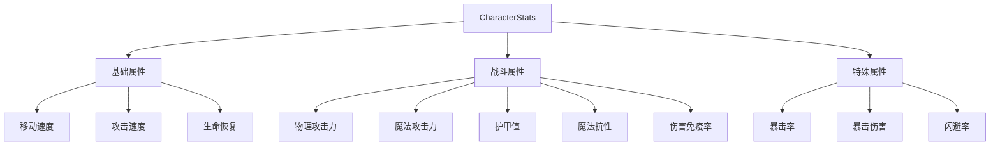
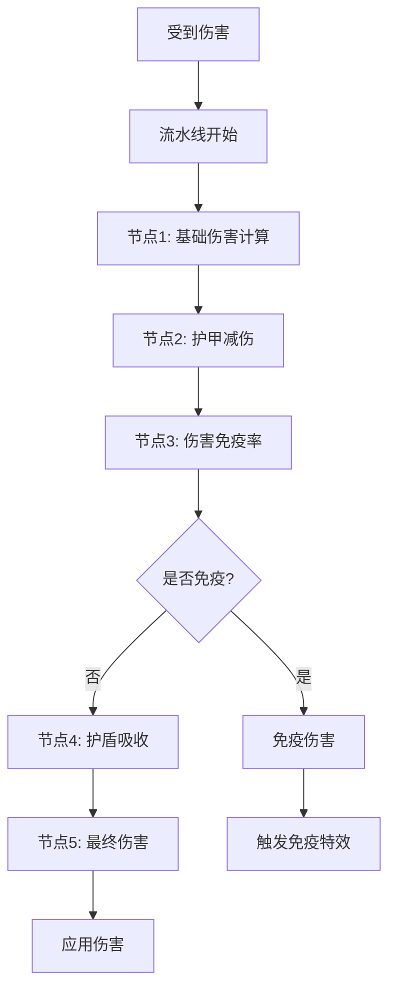
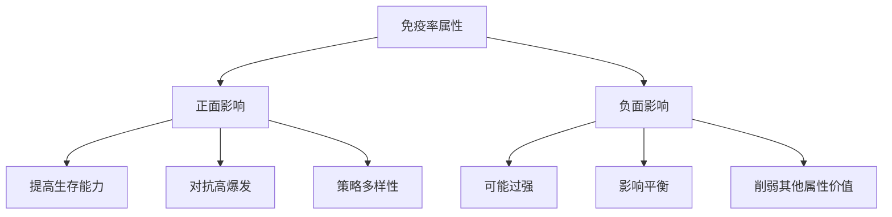

# 战斗属性系统

## 核心概念

伤害免疫率属性是对现有战斗系统的扩展，通过在属性系统中定义新的属性类型，并在伤害计算流水线中加入专门的处理节点，实现了部分免疫伤害的效果。这个功能直接影响到战斗的核心玩法，需要仔细考虑平衡性。

## 属性系统架构

### 属性系统结构



### 属性定义

```csharp
// 属性类型枚举
public enum AttributeType
{
    // 基础属性
    MoveSpeed,
    AttackSpeed,
    HPRegen,

    // 战斗属性
    PhysicalAttack,
    MagicalAttack,
    Armor,
    MagicResistance,
    DamageImmunityRate,  // 伤害免疫率

    // 特殊属性
    CritRate,
    CritDamage,
    DodgeRate
}

// 属性数据结构
[System.Serializable]
public class AttributeData
{
    public AttributeType type;
    public float baseValue;
    public float currentValue;
    public List<AttributeModifier> modifiers = new List<AttributeModifier>();

    public float GetValue()
    {
        float value = baseValue;

        // 应用所有修饰器
        foreach (var modifier in modifiers)
        {
            switch (modifier.type)
            {
                case ModifierType.Additive:
                    value += modifier.value;
                    break;
                case ModifierType.Multiplicative:
                    value *= modifier.value;
                    break;
                case ModifierType.Override:
                    value = modifier.value;
                    break;
            }
        }

        currentValue = value;
        return value;
    }
}

// 修饰器类型
public enum ModifierType
{
    Additive,       // 加法
    Multiplicative, // 乘法
    Override        // 覆盖
}

// 属性修饰器
[System.Serializable]
public class AttributeModifier
{
    public ModifierType type;
    public float value;
    public string source;  // 来源（装备、Buff、技能等）
    public float duration; // 持续时间（-1表示永久）
    public float startTime;

    public bool IsExpired(float currentTime)
    {
        return duration >= 0 && (currentTime - startTime) >= duration;
    }
}
```

## 伤害免疫率实现

### 属性系统核心类

```csharp
public class CharacterStats : MonoBehaviour
{
    private Dictionary<AttributeType, AttributeData> attributes = new Dictionary<AttributeType, AttributeData>();

    private void Awake()
    {
        InitializeAttributes();
    }

    private void InitializeAttributes()
    {
        // 初始化所有属性
        AddAttribute(AttributeType.MoveSpeed, 5f);
        AddAttribute(AttributeType.AttackSpeed, 1f);
        AddAttribute(AttributeType.PhysicalAttack, 10f);
        AddAttribute(AttributeType.Armor, 0f);
        AddAttribute(AttributeType.DamageImmunityRate, 0f); // 伤害免疫率默认为0
    }

    private void AddAttribute(AttributeType type, float baseValue)
    {
        AttributeData data = new AttributeData
        {
            type = type,
            baseValue = baseValue,
            currentValue = baseValue
        };

        attributes[type] = data;
    }

    public float GetAttribute(AttributeType type)
    {
        if (attributes.TryGetValue(type, out AttributeData data))
        {
            return data.GetValue();
        }
        return 0f;
    }

    public void SetAttributeBase(AttributeType type, float value)
    {
        if (attributes.TryGetValue(type, out AttributeData data))
        {
            data.baseValue = value;
        }
    }

    public void AddModifier(AttributeType type, AttributeModifier modifier)
    {
        if (attributes.TryGetValue(type, out AttributeData data))
        {
            data.modifiers.Add(modifier);
        }
    }

    public void RemoveModifier(AttributeType type, string source)
    {
        if (attributes.TryGetValue(type, out AttributeData data))
        {
            data.modifiers.RemoveAll(m => m.source == source);
        }
    }

    private void Update()
    {
        // 清理过期的修饰器
        float currentTime = Time.time;
        foreach (var attribute in attributes.Values)
        {
            attribute.modifiers.RemoveAll(m => m.IsExpired(currentTime));
        }
    }
}
```

### 伤害计算流水线



### 伤害处理系统

```csharp
public class DamageProcessor : MonoBehaviour
{
    private CharacterStats characterStats;

    private void Awake()
    {
        characterStats = GetComponent<CharacterStats>();
    }

    // 伤害信息结构
    public struct DamageInfo
    {
        public float baseDamage;
        public DamageType damageType;
        public GameObject attacker;
        public bool isCrit;
        public float critMultiplier;
        public Vector3 hitPoint;
    }

    // 伤害类型
    public enum DamageType
    {
        Physical,
        Magical,
        Pure  // 纯粹伤害，无视护甲和免疫
    }

    // 最终伤害结果
    public class DamageResult
    {
        public float finalDamage;
        public float damageBlocked;
        public float damageImmuned;
        public float damageAbsorbed;
        public bool isImmuned;
        public bool isDeadly;

        public override string ToString()
        {
            return $"最终伤害: {finalDamage}, " +
                   $"格挡: {damageBlocked}, " +
                   $"免疫: {damageImmuned}, " +
                   $"吸收: {damageAbsorbed}, " +
                   $"免疫: {(isImmuned ? "是" : "否")}";
        }
    }

    // 处理伤害的主入口
    public DamageResult ProcessDamage(DamageInfo damageInfo)
    {
        DamageResult result = new DamageResult();

        // 节点1: 获取基础伤害
        float damage = damageInfo.baseDamage;

        // 节点2: 应用护甲减伤
        damage = ApplyArmorReduction(damage, damageInfo.damageType, result);

        // 节点3: 应用伤害免疫率
        damage = ApplyDamageImmunity(damage, damageInfo, result);

        // 如果完全免疫，提前返回
        if (result.isImmuned)
        {
            result.finalDamage = 0;
            return result;
        }

        // 节点4: 应用护盾吸收
        damage = ApplyShieldAbsorption(damage, result);

        // 节点5: 计算最终伤害
        result.finalDamage = Mathf.Max(0, damage);
        result.isDeadly = result.finalDamage >= characterStats.GetAttribute(AttributeType.MaxHP);

        return result;
    }

    // 节点2: 护甲减伤
    private float ApplyArmorReduction(float damage, DamageType damageType, DamageResult result)
    {
        if (damageType == DamageType.Pure)
        {
            return damage; // 纯粹伤害无视护甲
        }

        float armor = damageType == DamageType.Physical
            ? characterStats.GetAttribute(AttributeType.Armor)
            : characterStats.GetAttribute(AttributeType.MagicResistance);

        // 使用常用的护甲减伤公式
        float damageReduction = armor / (100 + armor);
        float reducedDamage = damage * (1 - damageReduction);

        result.damageBlocked = damage - reducedDamage;
        return reducedDamage;
    }

    // 节点3: 伤害免疫率（核心功能）
    private float ApplyDamageImmunity(float damage, DamageInfo damageInfo, DamageResult result)
    {
        // 纯粹伤害不能被免疫
        if (damageInfo.damageType == DamageType.Pure)
        {
            result.isImmuned = false;
            return damage;
        }

        float immunityRate = characterStats.GetAttribute(AttributeType.DamageImmunityRate);

        // 方案1: 完全免疫（随机判定）
        if (ShouldUseRandomImmunity())
        {
            if (Random.value < immunityRate)
            {
                result.isImmuned = true;
                result.damageImmuned = damage;
                TriggerImmunityEffects(damageInfo);
                return 0;
            }
            return damage;
        }
        // 方案2: 部分免疫（按比例减少）
        else
        {
            float immunityAmount = damage * immunityRate;
            result.damageImmuned = immunityAmount;
            return damage - immunityAmount;
        }
    }

    // 判断使用哪种免疫模式
    private bool ShouldUseRandomImmunity()
    {
        // 可以通过配置或游戏设计决定
        // 返回 true 使用完全免疫模式
        // 返回 false 使用部分免疫模式
        return false; // 默认使用部分免疫
    }

    // 节点4: 护盾吸收
    private float ApplyShieldAbsorption(float damage, DamageResult result)
    {
        // 获取当前护盾值
        float shield = characterStats.GetCurrentShield();

        if (shield <= 0)
        {
            return damage;
        }

        float absorbed = Mathf.Min(shield, damage);
        characterStats.ConsumeShield(absorbed);

        result.damageAbsorbed = absorbed;
        return damage - absorbed;
    }

    // 触发免疫特效
    private void TriggerImmunityEffects(DamageInfo damageInfo)
    {
        // 播放免疫特效
        // 显示免疫文字
        // 触发相关技能效果

        Debug.Log($"触发了伤害免疫！免疫了 {damageInfo.baseDamage} 点伤害");
    }
}
```

## 平衡性考虑

### 免疫率属性的影响



### 平衡性策略

```csharp
public class DamageImmunityBalance
{
    // 1. 设置上限
    private const float MAX_IMMUNITY_RATE = 0.75f; // 最高75%免疫率

    // 2. 递减收益
    public float CalculateDiminishingReturns(float rawImmunityRate)
    {
        // 使用对数递减
        return Mathf.Log10(1 + rawImmunityRate * 9) / Mathf.Log10(10);
    }

    // 3. 成本系统
    public float CalculateImmunityCost(float immunityRate)
    {
        // 免疫率越高，成本呈指数增长
        return Mathf.Pow(immunityRate, 2);
    }

    // 4. 反制机制
    public float ApplyCounterMechanics(float immunityRate, DamageInfo damageInfo)
    {
        // 某些效果可以降低免疫率
        if (damageInfo.attacker != null)
        {
            AttackerStats attackerStats = damageInfo.attacker.GetComponent<AttackerStats>();
            if (attackerStats != null)
            {
                float penetration = attackerStats.GetImmunityPenetration();
                return Mathf.Max(0, immunityRate - penetration);
            }
        }
        return immunityRate;
    }

    // 5. 条件限制
    public bool CanApplyImmunity(DamageInfo damageInfo)
    {
        // 只对特定类型的伤害生效
        // 例如：只能免疫普通攻击，对技能伤害无效

        return damageInfo.damageType == DamageType.Physical;
    }
}
```

## 伤害免疫配置

### 配置系统

```csharp
// 免疫模式配置
public enum ImmunityMode
{
    None,                   // 无免疫
    Partial,                // 部分免疫（按比例减少伤害）
    RandomComplete,         // 随机完全免疫
    Conditional             // 条件免疫（满足条件时完全免疫）
}

// 免疫配置
[CreateAssetMenu(menuName = "Game/Immunity Config")]
public class ImmunityConfig : ScriptableObject
{
    [Header("基础配置")]
    public ImmunityMode mode = ImmunityMode.Partial;

    [Range(0f, 1f)]
    public float baseImmunityRate = 0f;

    [Range(0f, 1f)]
    public float maxImmunityRate = 0.75f;

    [Header("部分免疫配置")]
    public bool useDiminishingReturns = true;

    [Header("随机免疫配置")]
    [Range(0f, 1f)]
    public float randomImmunityChance = 0f;

    [Header("条件免疫配置")]
    public float hpThreshold = 0.3f; // 血量低于30%时生效

    public float GetEffectiveImmunityRate(CharacterStats characterStats, DamageInfo damageInfo)
    {
        float rate = Mathf.Min(baseImmunityRate, maxImmunityRate);

        switch (mode)
        {
            case ImmunityMode.None:
                return 0f;

            case ImmunityMode.Partial:
                if (useDiminishingReturns)
                {
                    DamageImmunityBalance balance = new DamageImmunityBalance();
                    rate = balance.CalculateDiminishingReturns(rate);
                }
                return rate;

            case ImmunityMode.RandomComplete:
                return Random.value < randomImmunityChance ? 1f : 0f;

            case ImmunityMode.Conditional:
                float hpPercent = characterStats.GetAttribute(AttributeType.MaxHP);
                return hpPercent < hpThreshold ? rate : 0f;

            default:
                return 0f;
        }
    }
}
```

## 扩展功能

### 免疫率动态调整

```csharp
public class DynamicImmunityController : MonoBehaviour
{
    private CharacterStats stats;
    private ImmunityConfig config;

    private void Start()
    {
        stats = GetComponent<CharacterStats>();
        config = GetComponent<ImmunityConfig>();
    }

    // 根据血量动态调整免疫率
    public void UpdateImmunityByHP()
    {
        float currentHP = stats.GetAttribute(AttributeType.CurrentHP);
        float maxHP = stats.GetAttribute(AttributeType.MaxHP);
        float hpPercent = currentHP / maxHP;

        float newImmunityRate = 0f;

        // 血量越低，免疫率越高
        if (hpPercent < 0.2f)
        {
            newImmunityRate = 0.5f; // 50%
        }
        else if (hpPercent < 0.4f)
        {
            newImmunityRate = 0.3f; // 30%
        }
        else if (hpPercent < 0.6f)
        {
            newImmunityRate = 0.1f; // 10%
        }

        stats.SetAttributeBase(AttributeType.DamageImmunityRate, newImmunityRate);
    }

    // 叠加免疫率
    public void StackImmunityRate(float additionalRate)
    {
        float currentRate = stats.GetAttribute(AttributeType.DamageImmunityRate);
        float newRate = Mathf.Min(1f, currentRate + additionalRate);
        stats.SetAttributeBase(AttributeType.DamageImmunityRate, newRate);
    }
}
```

### 免疫效果可视化

```csharp
public class ImmunityVisualizer : MonoBehaviour
{
    [SerializeField]
    private ParticleSystem immunityEffect;

    [SerializeField]
    private Material immunityMaterial;

    private void OnDamageImmuned(float damageAmount)
    {
        // 播放粒子特效
        if (immunityEffect != null)
        {
            immunityEffect.Play();
        }

        // 显示免疫文字
        ShowImmunityText(damageAmount);

        // 角色闪烁效果
        StartCoroutine(ImmunityFlashEffect());
    }

    private IEnumerator ImmunityFlashEffect()
    {
        Renderer[] renderers = GetComponentsInChildren<Renderer>();

        foreach (var renderer in renderers)
        {
            if (immunityMaterial != null)
            {
                renderer.material = immunityMaterial;
            }
        }

        yield return new WaitForSeconds(0.2f);

        // 恢复原始材质
        foreach (var renderer in renderers)
        {
            // 恢复逻辑
        }
    }

    private void ShowImmunityText(float damageAmount)
    {
        // 创建飘字特效
        // 显示 "IMMUNE" 或 "免疫"
    }
}
```

## 面试题解析

### Q: 伤害免疫率属性是怎么添加的？

**核心要点：**
1. ✅ 在属性系统中定义新的属性类型（DamageImmunityRate）
2. ✅ 在伤害计算流水线中加入专门的处理节点
3. ✅ 支持完全免疫和部分免疫两种模式
4. ✅ 仔细考虑平衡性，设置上限和递减收益
5. ✅ 提供反制机制和条件限制

**实现难点：**
- 平衡性调整：需要确保不会让某些角色变得过强
- 与其他系统的交互：需要考虑护甲、护盾等系统的优先级
- 玩家反馈：需要清晰显示免疫效果
- 性能优化：避免频繁的属性计算

## 相关链接

### Unity文档
- [ScriptableObject](https://docs.unity3d.com/Manual/class-ScriptableObject.html)
- [Serialization](https://docs.unity3d.com/Manual/script-Serialization.html)
- [Attributes](https://docs.unity3d.com/Manual/Attributes.html)

### 游戏设计
- [RPG Combat Systems](https://www.gamedeveloper.com/design/rpg-combat-system-design)
- [Game Balance](https://www.gamedeveloper.com/design/game-balance-theory)
- [Damage Formulas](https://www.gamedeveloper.com/design/damage-formula-design)

### 扩展阅读
- [Attribute Systems](https://gameprogrammingpatterns.com/component.html)
- [Combat Mechanics](https://www.informit.com/articles/article.aspx?p=2858416)
