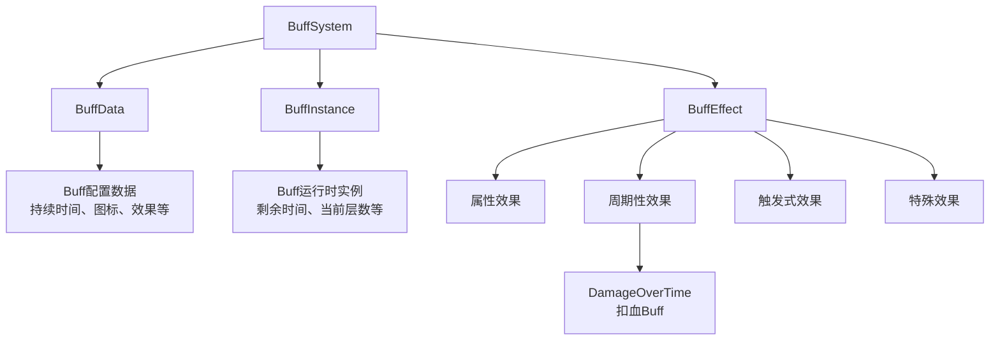
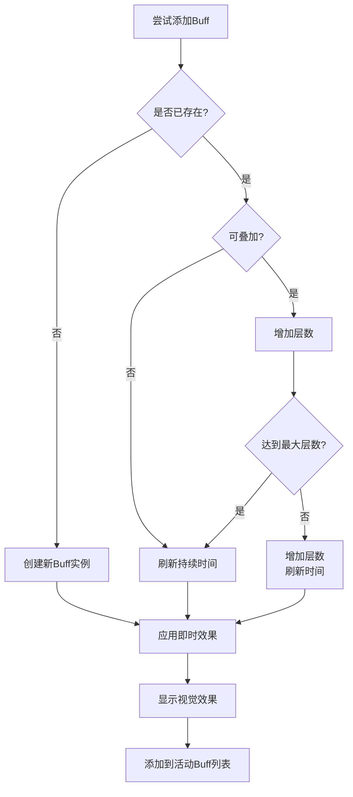

# Buff系统实现

## 核心概念

Buff系统是一个通用的效果框架，可以挂载各种效果到角色身上。扣血Buff本质上是周期性触发的效果，当这种Buff被添加到角色身上后，会以一定的时间间隔（比如每秒一次）对角色造成预设的伤害，并经过正常的伤害计算流程。

## Buff系统架构

### 系统层次结构



### Buff数据结构

```csharp
// Buff类型枚举
public enum BuffType
{
    Poison,           // 中毒
    Burn,             // 灼烧
    Bleed,            // 流血
    Regeneration,     // 再生
    Shield,           // 护盾
    Strength,         // 力量增强
    Speed,            // 速度提升
    Custom            // 自定义
}

// Buff效果类型
public enum BuffEffectType
{
    AttributeModify,  // 属性修改
    DamageOverTime,   // 持续伤害
    HealOverTime,     // 持续治疗
    Trigger,          // 触发效果
    Special           // 特殊效果
}

// Buff配置数据
[CreateAssetMenu(menuName = "Game/Buff Data")]
public class BuffData : ScriptableObject
{
    [Header("基础信息")]
    public string buffName;
    public BuffType buffType;
    public Sprite icon;
    [TextArea]
    public string description;

    [Header("时间配置")]
    public float duration = 5f;
    public bool isInfinite = false;
    public int maxStacks = 1;

    [Header("效果配置")]
    public List<BuffEffectConfig> effects = new List<BuffEffectConfig>();

    [Header("周期配置")]
    public float tickInterval = 1f; // 触发间隔

    [Header("视觉配置")]
    public GameObject particleEffect;
    public Color tint = Color.white;
}

// Buff效果配置
[System.Serializable]
public class BuffEffectConfig
{
    public BuffEffectType effectType;

    // 属性修改相关
    public AttributeType attributeType;
    public ModifierType modifierType;
    public float value;

    // 持续伤害相关
    public float damagePerTick;
    public DamageType damageType;

    // 持续治疗相关
    public float healPerTick;
}
```

### Buff实例类

```csharp
public class BuffInstance
{
    public BuffData Data { get; private set; }
    public int CurrentStacks { get; private set; }
    public float RemainingTime { get; private set; }
    public float LastTickTime { get; private set; }
    public CharacterStats Target { get; private set; }
    public GameObject Source { get; private set; }

    private bool isActive = true;

    public BuffInstance(BuffData data, CharacterStats target, GameObject source)
    {
        Data = data;
        Target = target;
        Source = source;
        CurrentStacks = 1;
        RemainingTime = data.duration;
        LastTickTime = Time.time;
    }

    public void Update(float deltaTime)
    {
        if (!isActive) return;

        // 更新剩余时间
        if (!Data.isInfinite)
        {
            RemainingTime -= deltaTime;
            if (RemainingTime <= 0)
            {
                isActive = false;
                return;
            }
        }

        // 处理周期性效果
        UpdateTickEffects();
    }

    private void UpdateTickEffects()
    {
        float currentTime = Time.time;

        if (currentTime - LastTickTime >= Data.tickInterval)
        {
            // 触发周期性效果
            TriggerTickEffects();
            LastTickTime = currentTime;
        }
    }

    private void TriggerTickEffects()
    {
        foreach (var effect in Data.effects)
        {
            switch (effect.effectType)
            {
                case BuffEffectType.DamageOverTime:
                    ApplyDamageOverTime(effect);
                    break;
                case BuffEffectType.HealOverTime:
                    ApplyHealOverTime(effect);
                    break;
            }
        }
    }

    private void ApplyDamageOverTime(BuffEffectConfig effect)
    {
        if (Target == null) return;

        // 构造伤害信息
        DamageProcessor.DamageInfo damageInfo = new DamageProcessor.DamageInfo
        {
            baseDamage = effect.damagePerTick,
            damageType = effect.damageType,
            attacker = Source
        };

        // 通过伤害处理器处理伤害
        DamageProcessor processor = Target.GetComponent<DamageProcessor>();
        if (processor != null)
        {
            DamageProcessor.DamageResult result = processor.ProcessDamage(damageInfo);
            Target.TakeDamage(result.finalDamage);

            // 触发反馈效果
            ShowDamageFeedback(result);
        }
    }

    private void ApplyHealOverTime(BuffEffectConfig effect)
    {
        if (Target == null) return;

        Target.Heal(effect.healPerTick);
        ShowHealFeedback(effect.healPerTick);
    }

    private void ShowDamageFeedback(DamageProcessor.DamageResult result)
    {
        // 显示飘血数字
        // 播放受击特效
        // 触发声音效果

        Debug.Log($"持续伤害: {result.finalDamage}");
    }

    private void ShowHealFeedback(float healAmount)
    {
        // 显示治疗数字
        // 播放治疗特效

        Debug.Log($"持续治疗: {healAmount}");
    }

    public void AddStack()
    {
        if (CurrentStacks < Data.maxStacks)
        {
            CurrentStacks++;

            // 刷新持续时间
            RemainingTime = Data.duration;
        }
        else
        {
            // 已达最大层数，只刷新时间
            RemainingTime = Data.duration;
        }
    }

    public void RemoveStack()
    {
        CurrentStacks--;
        if (CurrentStacks <= 0)
        {
            isActive = false;
        }
    }

    public bool IsActive => isActive;
}
```

## Buff管理器

### Buff系统核心

```csharp
public class BuffManager : MonoBehaviour
{
    private List<BuffInstance> activeBuffs = new List<BuffInstance>();
    private CharacterStats characterStats;

    private void Awake()
    {
        characterStats = GetComponent<CharacterStats>();
    }

    private void Update()
    {
        UpdateBuffs();
    }

    private void UpdateBuffs()
    {
        // 更新所有Buff
        for (int i = activeBuffs.Count - 1; i >= 0; i--)
        {
            BuffInstance buff = activeBuffs[i];
            buff.Update(Time.deltaTime);

            // 移除不活跃的Buff
            if (!buff.IsActive)
            {
                RemoveBuffInternal(buff);
                activeBuffs.RemoveAt(i);
            }
        }
    }

    // 添加Buff
    public BuffInstance AddBuff(BuffData buffData, GameObject source)
    {
        // 检查是否已存在相同类型的Buff
        BuffInstance existingBuff = GetBuff(buffData.buffType);

        if (existingBuff != null)
        {
            // 根据配置决定是刷新时间还是叠加层数
            if (buffData.maxStacks > 1)
            {
                existingBuff.AddStack();
            }
            else
            {
                // 刷新持续时间
                existingBuff.RemainingTime = buffData.duration;
            }

            return existingBuff;
        }

        // 创建新的Buff实例
        BuffInstance newBuff = new BuffInstance(buffData, characterStats, source);
        activeBuffs.Add(newBuff);

        // 应用即时效果
        ApplyImmediateEffects(newBuff);

        // 触发视觉效果
        ShowBuffVisuals(newBuff);

        return newBuff;
    }

    // 移除Buff
    public void RemoveBuff(BuffType buffType)
    {
        BuffInstance buff = GetBuff(buffType);
        if (buff != null)
        {
            buff.IsActive = false;
        }
    }

    private void RemoveBuffInternal(BuffInstance buff)
    {
        // 移除属性修饰器
        RemoveAttributeModifiers(buff);

        // 移除视觉效果
        HideBuffVisuals(buff);

        Debug.Log($"移除Buff: {buff.Data.buffName}");
    }

    // 获取指定类型的Buff
    public BuffInstance GetBuff(BuffType buffType)
    {
        return activeBuffs.Find(b => b.Data.buffType == buffType);
    }

    // 检查是否有指定类型的Buff
    public bool HasBuff(BuffType buffType)
    {
        return activeBuffs.Exists(b => b.Data.buffType == buffType);
    }

    // 获取Buff层数
    public int GetBuffStacks(BuffType buffType)
    {
        BuffInstance buff = GetBuff(buffType);
        return buff != null ? buff.CurrentStacks : 0;
    }

    private void ApplyImmediateEffects(BuffInstance buff)
    {
        foreach (var effect in buff.Data.effects)
        {
            if (effect.effectType == BuffEffectType.AttributeModify)
            {
                ApplyAttributeModifier(buff, effect);
            }
        }
    }

    private void ApplyAttributeModifier(BuffInstance buff, BuffEffectConfig effect)
    {
        AttributeModifier modifier = new AttributeModifier
        {
            type = effect.modifierType,
            value = effect.value,
            source = buff.Data.buffName,
            duration = buff.Data.duration,
            startTime = Time.time
        };

        characterStats.AddModifier(effect.attributeType, modifier);
    }

    private void RemoveAttributeModifiers(BuffInstance buff)
    {
        foreach (var effect in buff.Data.effects)
        {
            if (effect.effectType == BuffEffectType.AttributeModify)
            {
                characterStats.RemoveModifier(effect.attributeType, buff.Data.buffName);
            }
        }
    }

    private void ShowBuffVisuals(BuffInstance buff)
    {
        // 创建粒子特效
        if (buff.Data.particleEffect != null)
        {
            GameObject particle = Instantiate(buff.Data.particleEffect, transform);
            particle.transform.localPosition = Vector3.zero;

            // 根据持续时间自动销毁
            Destroy(particle, buff.RemainingTime);
        }

        // 改变角色颜色
        ApplyTintEffect(buff);
    }

    private void HideBuffVisuals(BuffInstance buff)
    {
        // 清理视觉特效
        // 恢复角色颜色
    }

    private void ApplyTintEffect(BuffInstance buff)
    {
        Renderer[] renderers = GetComponentsInChildren<Renderer>();
        foreach (var renderer in renderers)
        {
            if (renderer.material.HasProperty("_Color"))
            {
                renderer.material.color = buff.Data.tint;
            }
        }
    }
}
```

## 扣血Buff实现

### 中毒Buff配置示例

```csharp
// 创建中毒Buff配置
public static class BuffDataCreator
{
    public static BuffData CreatePoisonBuff()
    {
        BuffData poisonBuff = ScriptableObject.CreateInstance<BuffData>();
        poisonBuff.buffName = "Poison";
        poisonBuff.buffType = BuffType.Poison;
        poisonBuff.description = "每秒受到5点毒伤害，持续10秒";
        poisonBuff.duration = 10f;
        poisonBuff.maxStacks = 3;
        poisonBuff.tickInterval = 1f;
        poisonBuff.tint = new Color(0.2f, 0.8f, 0.2f); // 绿色

        // 配置持续伤害效果
        BuffEffectConfig damageEffect = new BuffEffectConfig
        {
            effectType = BuffEffectType.DamageOverTime,
            damagePerTick = 5f,
            damageType = DamageType.Magical // 中毒通常是魔法伤害
        };

        poisonBuff.effects.Add(damageEffect);

        return poisonBuff;
    }

    public static BuffData CreateBurnBuff()
    {
        BuffData burnBuff = ScriptableObject.CreateInstance<BuffData>();
        burnBuff.buffName = "Burn";
        burnBuff.buffType = BuffType.Burn;
        burnBuff.description = "每秒受到8点燃烧伤害，持续8秒";
        burnBuff.duration = 8f;
        burnBuff.maxStacks = 5; // 灼烧可以叠加更多层
        burnBuff.tickInterval = 0.5f; // 灼烧触发频率更高
        burnBuff.tint = new Color(1f, 0.3f, 0f); // 橙红色

        BuffEffectConfig damageEffect = new BuffEffectConfig
        {
            effectType = BuffEffectType.DamageOverTime,
            damagePerTick = 8f,
            damageType = DamageType.Magical
        };

        burnBuff.effects.Add(damageEffect);

        return burnBuff;
    }

    public static BuffData CreateBleedBuff()
    {
        BuffData bleedBuff = ScriptableObject.CreateInstance<BuffData>();
        bleedBuff.buffName = "Bleed";
        bleedBuff.buffType = BuffType.Bleed;
        bleedBuff.description = "每秒受到10点流血伤害，持续6秒";
        bleedBuff.duration = 6f;
        bleedBuff.maxStacks = 1; // 流血通常不能叠加
        bleedBuff.tickInterval = 1f;
        bleedBuff.tint = new Color(0.8f, 0f, 0f); // 深红色

        BuffEffectConfig damageEffect = new BuffEffectConfig
        {
            effectType = BuffEffectType.DamageOverTime,
            damagePerTick = 10f,
            damageType = DamageType.Physical // 流血是物理伤害
        };

        bleedBuff.effects.Add(damageEffect);

        return bleedBuff;
    }
}
```

### Buff效果叠加逻辑



## 可视化反馈

### 飘血数字系统

```csharp
public class FloatingTextManager : MonoBehaviour
{
    [SerializeField]
    private GameObject floatingTextPrefab;

    [SerializeField]
    private Canvas canvas;

    public void ShowDamageText(Vector3 worldPosition, float damage, bool isCrit = false)
    {
        GameObject textObj = Instantiate(floatingTextPrefab, canvas.transform);
        TextMeshProUGUI textComponent = textObj.GetComponent<TextMeshProUGUI>();

        if (textComponent != null)
        {
            textComponent.text = Mathf.RoundToInt(damage).ToString();
            textComponent.color = Color.red;

            if (isCrit)
            {
                textComponent.fontSize *= 1.5f;
                textComponent.color = new Color(1f, 0.5f, 0f); // 橙色
            }
        }

        // 设置位置
        Vector2 screenPosition = Camera.main.WorldToScreenPoint(worldPosition);
        textObj.transform.position = screenPosition;

        // 启动飘字动画
        FloatingTextAnimation animation = textObj.GetComponent<FloatingTextAnimation>();
        if (animation != null)
        {
            animation.Play();
        }
        else
        {
            // 如果没有动画组件，一段时间后自动销毁
            Destroy(textObj, 1f);
        }
    }

    public void ShowHealText(Vector3 worldPosition, float healAmount)
    {
        GameObject textObj = Instantiate(floatingTextPrefab, canvas.transform);
        TextMeshProUGUI textComponent = textObj.GetComponent<TextMeshProUGUI>();

        if (textComponent != null)
        {
            textComponent.text = $"+{Mathf.RoundToInt(healAmount)}";
            textComponent.color = Color.green;
        }

        Vector2 screenPosition = Camera.main.WorldToScreenPoint(worldPosition);
        textObj.transform.position = screenPosition;

        Destroy(textObj, 1f);
    }
}
```

### 受击特效系统

```csharp
public class HitEffectManager : MonoBehaviour
{
    [SerializeField]
    private GameObject hitParticlePrefab;

    [SerializeField]
    private GameObject poisonParticlePrefab;

    [SerializeField]
    private GameObject burnParticlePrefab;

    public void PlayHitEffect(Vector3 position, DamageType damageType)
    {
        GameObject effectPrefab = GetEffectForDamageType(damageType);
        if (effectPrefab != null)
        {
            GameObject effect = Instantiate(effectPrefab, position, Quaternion.identity);
            Destroy(effect, 2f);
        }
    }

    public void PlayBuffEffect(Vector3 position, BuffType buffType)
    {
        GameObject effectPrefab = GetEffectForBuffType(buffType);
        if (effectPrefab != null)
        {
            GameObject effect = Instantiate(effectPrefab, position, Quaternion.identity);
            Destroy(effect, 2f);
        }
    }

    private GameObject GetEffectForDamageType(DamageType damageType)
    {
        switch (damageType)
        {
            case DamageType.Physical:
                return hitParticlePrefab;
            case DamageType.Magical:
                return hitParticlePrefab;
            default:
                return null;
        }
    }

    private GameObject GetEffectForBuffType(BuffType buffType)
    {
        switch (buffType)
        {
            case BuffType.Poison:
                return poisonParticlePrefab;
            case BuffType.Burn:
                return burnParticlePrefab;
            default:
                return null;
        }
    }
}
```

## Buff界面显示

### Buff图标UI

```csharp
public class BuffIconUI : MonoBehaviour
{
    [SerializeField]
    private Image buffIcon;

    [SerializeField]
    private Text durationText;

    [SerializeField]
    private Text stackText;

    [SerializeField]
    private Image cooldownOverlay;

    private BuffInstance buffInstance;

    public void Initialize(BuffInstance buff)
    {
        buffInstance = buff;

        // 设置图标
        if (buffIcon != null && buff.Data != null)
        {
            buffIcon.sprite = buff.Data.icon;
        }

        UpdateDisplay();
    }

    private void Update()
    {
        if (buffInstance != null && buffInstance.IsActive)
        {
            UpdateDisplay();
        }
        else
        {
            Destroy(gameObject);
        }
    }

    private void UpdateDisplay()
    {
        // 更新剩余时间
        if (durationText != null)
        {
            durationText.text = Mathf.CeilToInt(buffInstance.RemainingTime).ToString();
        }

        // 更新层数
        if (stackText != null && buffInstance.CurrentStacks > 1)
        {
            stackText.text = buffInstance.CurrentStacks.ToString();
            stackText.gameObject.SetActive(true);
        }
        else if (stackText != null)
        {
            stackText.gameObject.SetActive(false);
        }

        // 更新冷却遮罩
        if (cooldownOverlay != null && buffInstance.Data != null)
        {
            float fillAmount = buffInstance.RemainingTime / buffInstance.Data.duration;
            cooldownOverlay.fillAmount = 1 - fillAmount;
        }
    }
}
```

## 面试题解析

### Q: 给英雄扣血的Buff是怎么添加的？

**核心要点：**
1. ✅ 基于通用Buff框架实现
2. ✅ 周期性触发效果（每秒造成伤害）
3. ✅ 伤害经过正常的伤害计算流程
4. ✅ 支持多层叠加和持续时间刷新
5. ✅ 完整的视觉反馈（飘血、特效、音效）

**实现流程：**
1. 创建BuffData配置数据（持续伤害、触发间隔等）
2. 创建BuffInstance运行时实例
3. 每个tick触发时调用伤害处理接口
4. 伤害经过护甲、免疫等计算
5. 触发飘血数字、受击动画等反馈

**技术优势：**
- 模块化设计，易于扩展新效果
- 复用现有的伤害计算系统
- 支持多种持续时间伤害类型（中毒、灼烧、流血）
- 良好的视觉反馈，提升玩家体验

## 相关链接

### Unity文档
- [ScriptableObject](https://docs.unity3d.com/Manual/class-ScriptableObject.html)
- [Coroutines](https://docs.unity3d.com/Manual/Coroutines.html)
- [Particle System](https://docs.unity3d.com/Manual/ParticleSystems.html)

### 游戏设计
- [Buff Systems](https://www.gamedeveloper.com/design/buff-and-debuff-systems)
- [DoT Effects](https://www.gamedeveloper.com/design/damage-over-time-effects)
- [Status Effects](https://www.gamedeveloper.com/design/status-effect-systems)

### 扩展阅读
- [Effect Systems](https://gameprogrammingpatterns.com/bytecode.html)
- [Combat Feedback](https://www.gamedeveloper.com/design/combat-feedback-systems)
